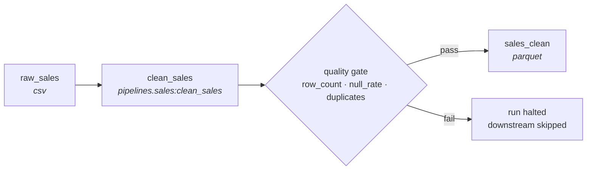
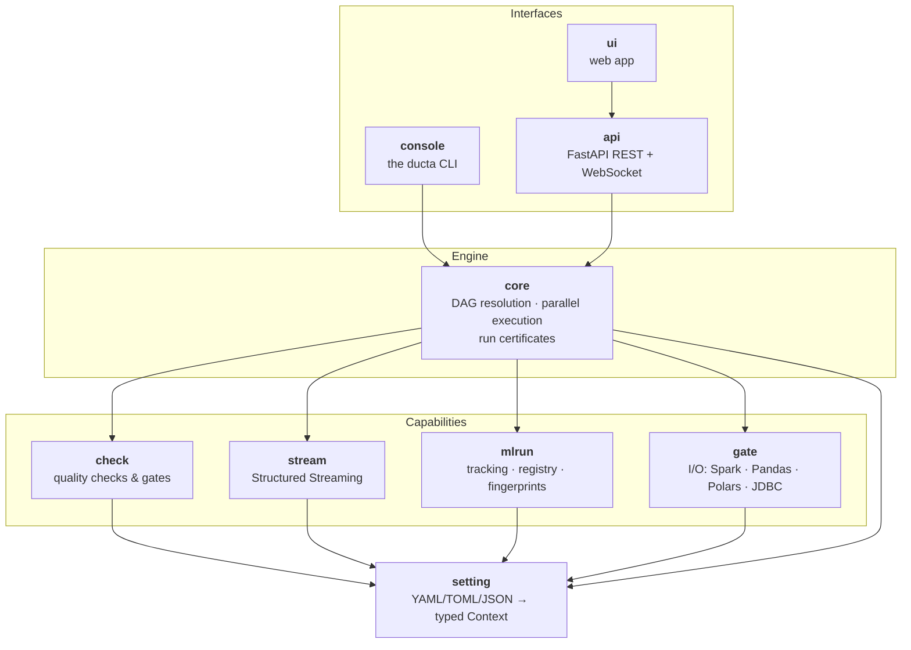

<div align="center">

# DUCTA

### Build data pipelines you can trust.

An open-source Python framework for building **reproducible**, **quality-controlled**
and **auditable** data pipelines across local Spark and Databricks.

[](https://www.python.org/)
[](https://github.com/faustinolopezramos/ducta/blob/main/LICENSE)
[](https://github.com/faustinolopezramos/ducta/blob/main/CHANGELOG.md)

</div>

---

## 60-second demo

<!--
  TODO — the demo asset does not exist yet. Record the three commands below as
  docs/img/ducta-demo.gif, commit it, then delete these comment markers to show it.
  The URL must stay absolute: this README is also the PyPI long description,
  where relative image paths do not resolve.

<div align="center">
  
</div>
-->

Install, run, and prove a pipeline — three commands:

```bash
pip install "ducta[spark]"

# 1. Scaffold a project (Medallion layout: bronze → silver → gold)
ducta template --template medallion_basic --project-name my_project && cd my_project

# 2. Run the pipeline it ships with
ducta start --env dev --pipeline etl

# 3. Prove what just happened
ducta certify verify --run-id <run-id>
```

---

## Why Ducta?

<table>
<tr>
<td width="33%" valign="top">

### BUILD

Define pipelines with configuration and ordinary Python.

Your transformations are plain functions taking DataFrames. Ducta resolves the
dependency graph, runs the nodes in the right order, and handles the I/O — the
same project runs on local Spark or Databricks with no code change.

</td>
<td width="33%" valign="top">

### QUALITY

Validate data automatically before bad data moves downstream.

Declare checks next to the step that produces the data — row counts, null
rates, ranges, duplicates, schema, freshness, drift. A quality gate decides
whether a failure warns or halts the run.

</td>
<td width="33%" valign="top">

### PROVE

Every execution produces verifiable evidence of what ran, against which data,
and with what result.

Each run emits a self-hashed **run certificate**: inputs and outputs
fingerprinted, every node's outcome, every quality verdict — integrity-checked,
and tamper-evident once you configure a signing key.

</td>
</tr>
</table>

---

## Quick Start

**Requires Python 3.10–3.13.** From nothing to a verified run in under five minutes.

### 1. Install and run

The three commands from the demo above, with what to expect from each:

```bash
pip install "ducta[spark]"

ducta template --template medallion_basic --project-name my_project && cd my_project
ducta start --env dev --pipeline etl
```

That is it. The scaffold ships **sample data and a working `etl` pipeline**
(Extract → Transform → Load, CSV → Parquet → CSV), so the run reads real rows,
applies quality checks, writes output, and emits a run certificate — before you
have written a line of code.

> **Budget about 4 minutes, and it is nearly all `pip`.** Ducta itself is small;
> `pyspark` is a ~300 MB download that pulls in a JVM runtime. Once installed,
> scaffolding is instant and the sample pipeline runs in seconds.

Look around before changing anything:

```bash
ducta config list-pipelines                          # → etl
ducta certify list                                   # the run you just did
ducta certify verify --run-id <run-id>               # prove it
```

<details>
<summary><b>Do I really need Spark?</b> — and other extras</summary>

**To *execute* a pipeline, yes.** Every file reader and writer is Spark-backed
(`ducta.gate`), so a run that touches data needs a session.

**To install, scaffold, or inspect one, no.** The session is created lazily on
first genuine access, so on a bare `pip install ducta` these all work:
`ducta template`, `ducta config list-pipelines`, `ducta start --validate-only`,
and `ducta certify list/show/verify`. Useful in CI, where you may want to
validate configuration or check certificates without paying for a JVM.

```bash
pip install "ducta[mlops]"        # + experiment tracking & model registry
pip install "ducta[api]"          # + web app / REST API
pip install "ducta[all]"          # everything above
```

**`databricks` is a separate, mutually exclusive extra.** Use
`pip install "ducta[databricks]"` *instead of* `[spark]`, never alongside it:
`databricks-connect` ships its own `pyspark` package and overwrites the real
one, after which local execution fails. That is why it is not part of `[all]`.
You do not need to think about this until you actually target Databricks.

</details>

### 2. Now add a transformation of your own

A normal Python function. Ducta passes the input DataFrame and the run's date
range; you return the result.

```python
# pipelines/sales.py
def clean_sales(sales, start_date, end_date):
    return sales.dropna()
```

### 3. Wire it up

```yaml
# catalog.yaml — every dataset, once: where it lives, how it is written
raw_sales:
  format: csv
  path: ${paths.input}/sales.csv
  options: {header: true, inferSchema: true}
core.analytics.sales_clean:
  format: parquet
  write: {mode: overwrite}
```

```yaml
# pipelines/sales_daily.yaml — the pipeline (file name) and its nodes
nodes:
  clean_sales:
    run: pipelines.sales:clean_sales
    inputs: {sales: raw_sales}
    outputs: [core.analytics.sales_clean]
    quality:
      checks:
        row_count: {min: 1000}                      # expect at least 1,000 rows
        null_rate: {columns: [id], threshold: 0.0}  # no missing ids
        duplicates: {columns: [id]}                 # ids must be unique
      gate: {max_errors: 0}                         # any error blocks downstream steps
```

A misspelled key or a dataset name missing from the catalog is reported with
its file and line; a wrong check parameter (`thresold`) is caught by the
preflight — either way, before anything runs.

### 4. Run it

```bash
ducta start --env dev --pipeline sales_daily \
  --start-date 2026-01-01 --end-date 2026-01-31
```

Ducta reads `raw_sales`, runs `clean_sales`, validates the output, writes
`sales_clean`, and records a run certificate — all from that configuration.

### 5. Write the configuration in YAML, TOML or JSON

The format is only syntax: `ducta.*`, `catalog.*` and each file under `pipelines/`
can be YAML, TOML or JSON, and a project may mix them (`pipelines/etl.yaml` next
to `pipelines/report.toml`). All three mean the same thing — `ducta config show
--engine` prints identical documents for them.

```bash
ducta template --template medallion_basic --project-name orders --format toml
ducta config convert --to json --out ../orders-json     # rewrite a project in another format
```

The same pipeline, `pipelines/etl`:

<details open>
<summary><b>YAML</b> — <code>pipelines/etl.yaml</code> (comments, the most compact)</summary>

```yaml
description: "Orders: land, clean, aggregate"
type: batch
requires_dates: false

nodes:
  extract:
    run: pipelines.etl:extract
    inputs: {source_data: source_data}
    outputs: [bronze.etl.raw_data]

  transform:
    run: pipelines.etl:transform
    inputs: {raw_data: bronze.etl.raw_data}
    outputs: [silver.etl.clean_data]
    quality:
      null_rate: {columns: [amount], threshold: 0.0}
      range: {column: amount, min: 0}
      gate: {max_errors: 0, on_fail: skip_downstream}

  load:
    run: pipelines.etl:load
    inputs: {clean_data: silver.etl.clean_data}
    outputs: [gold.etl.final_output]
```

</details>

<details>
<summary><b>TOML</b> — <code>pipelines/etl.toml</code></summary>

```toml
#:schema ../.ducta/schema/pipeline.json
description = "Orders: land, clean, aggregate"
type = "batch"
requires_dates = false

[nodes.extract]
run = "pipelines.etl:extract"
outputs = [
    "bronze.etl.raw_data",
]

[nodes.extract.inputs]
source_data = "source_data"

[nodes.transform]
run = "pipelines.etl:transform"
outputs = [
    "silver.etl.clean_data",
]

[nodes.transform.inputs]
raw_data = "bronze.etl.raw_data"

[nodes.transform.quality.null_rate]
columns = [
    "amount",
]
threshold = 0.0

[nodes.transform.quality.range]
column = "amount"
min = 0

[nodes.transform.quality.gate]
max_errors = 0
on_fail = "skip_downstream"

[nodes.load]
run = "pipelines.etl:load"
outputs = [
    "gold.etl.final_output",
]

[nodes.load.inputs]
clean_data = "silver.etl.clean_data"
```

</details>

<details>
<summary><b>JSON</b> — <code>pipelines/etl.json</code> (for files written by tools; no comments)</summary>

```json
{
  "$schema": "../.ducta/schema/pipeline.json",
  "description": "Orders: land, clean, aggregate",
  "type": "batch",
  "requires_dates": false,
  "nodes": {
    "extract": {
      "run": "pipelines.etl:extract",
      "inputs": {
        "source_data": "source_data"
      },
      "outputs": [
        "bronze.etl.raw_data"
      ]
    },
    "transform": {
      "run": "pipelines.etl:transform",
      "inputs": {
        "raw_data": "bronze.etl.raw_data"
      },
      "outputs": [
        "silver.etl.clean_data"
      ],
      "quality": {
        "null_rate": {
          "columns": [
            "amount"
          ],
          "threshold": 0.0
        },
        "range": {
          "column": "amount",
          "min": 0
        },
        "gate": {
          "max_errors": 0,
          "on_fail": "skip_downstream"
        }
      }
    },
    "load": {
      "run": "pipelines.etl:load",
      "inputs": {
        "clean_data": "silver.etl.clean_data"
      },
      "outputs": [
        "gold.etl.final_output"
      ]
    }
  }
}
```

</details>

Pick YAML for pipelines you read and explain in comments, TOML for flat settings,
JSON for generated files. `ducta config validate` reports errors with file and line
in all three. Details: [File formats](https://github.com/faustinolopezramos/ducta/blob/main/docs/configuration.rst).

### 6. Prefer a visual workspace?

```bash
ducta server start --port 8000     # web app & API docs at http://localhost:8000
```

Browse pipelines, edit configuration, launch runs, and watch logs stream live.

---

## See it in action

**What you declared** — a catalog, a pipeline file and one Python function:



**What Ducta produced** — `<output>/<env>/.ducta/runs/<run-id>/certificate.json`:

```jsonc
{
  "schema_version": "1.6",
  "run_id": "9f3c1a70b4d84e2ba61c07d5e8f21c3d",
  "pipeline": "sales_daily",
  "environment_name": "dev",
  "status": "success",
  "started_at": "2026-01-01T09:00:00+00:00",
  "ended_at": "2026-01-01T09:01:12+00:00",
  "duration_seconds": 72.418,
  "ducta_version": "0.2.0",
  "config_fingerprint": "sha256:6c1f…",     // the config this ran with
  "environment": {                           // where it ran
    "python_version": "3.12.4", "os_info": "Linux 6.8.0",
    "git_commit": "b7f0e91", "git_branch": "main", "git_dirty": false,
    "pip_packages": { … }, "env_hash": "sha256:0d5a…"
  },
  "nodes": [
    { "name": "clean_sales", "type": "batch", "status": "success",
      "duration_seconds": 41.09, "outputs": ["core.analytics.sales_clean"],
      "error": null }
  ],
  "inputs": {                                // which data went in
    "raw_sales": { "filepath": "data/sales.csv", "file_size_bytes": 48213904,
                   "engine": "spark", "algorithm": "xxhash64-multiset/v2",
                   "mode": "exact", "row_count": 1204331,
                   "schema_hash": "sha256:9ab0…",
                   "content_hash": "sha256:31de…",
                   "fingerprint": "sha256:31de…" }
  },
  "outputs": {                               // which data came out
    "core.analytics.sales_clean": { "engine": "spark",
                                    "algorithm": "xxhash64-multiset/v2",
                                    "mode": "exact", "row_count": 1198677,
                                    "content_hash": "sha256:7c42…",
                                    "fingerprint": "sha256:7c42…" }
  },
  "quality": [                               // every verdict, not just failures
    { "node": "clean_sales", "phase": "data_quality", "passed": true,
      "score": 1.0, "errors": 0, "warnings": 0, "checks": 3 }
  ],
  "code": { "nodes": { "pipelines.sales.clean_sales": {   // the logic each node ran
    "scope": "function", "source_hash": "sha256:52aa…" } } },
  "evidence_complete": true,                 // did the run record everything it was asked to?
  "evidence_gaps": [],                       // and if not, what it could not record
  "signed": true,                            // inside the hash, so it cannot be stripped
  "evidence_level": "signed",                // the project's evidence policy, also hashed
  "certificate_hash": "sha256:e1b7…",        // SHA-256 over everything above
  "signature": "hmac-sha256:44c9…"           // optional, when a key is configured
}
```

**Verify it later** — anyone, on any machine, without rerunning the pipeline:

```bash
ducta certify list                                    # every run recorded here
ducta certify show   --run-id 9f3c1a70               # a prefix is enough
ducta certify verify --run-id 9f3c1a70               # integrity (+ signature, with the key)
ducta certify verify --run-id 9f3c1a70 --reproduce \
  --start-date 2026-01-01 --end-date 2026-01-31       # re-run, compare every output
```

**What the two levels actually prove.** `certificate_hash` is a plain SHA-256
over every other field, computed with no secret. It detects *corruption* — a
truncated file, a botched merge, a hand-edit someone forgot to cover their
tracks on — but it is not, on its own, evidence against a motivated editor:
anyone who changes a field can recompute the hash and `verify` will pass.
That is why `verify` reports the *level* it reached — `integrity` for a hash
match alone, `authenticated` only once a signature has been checked against
the key — and says "untampered" only for the latter.

Set `DUCTA_CERTIFICATE_KEY` and the certificate is HMAC-signed over that hash.
*That* is what makes it tamper-evident: forging it requires the key, `key_id`
records which key signed, and — because the certificate records *that* it was
signed inside the hashed content — deleting the signature to pass as merely
unsigned does not add up either, and `verify` rejects it with or without the
key. **Configure a key for any certificate you intend to rely on as evidence
later.** `--reproduce` is a third, stronger level: it re-runs the pipeline and
confirms each output fingerprint still matches what the certificate claims.

Certificates written before schema `1.3` carry no such marker, so `verify`
cannot tell "never signed" from "signature removed" for them: given a key, it
reports them as *unverifiable* rather than passing them. Verify without a key
to check their integrity alone.

**Choose how much evidence a run must leave.** `evidence_level` in
`global_config` is the project's policy, not Ducta's:

| `evidence_level` | Certificate | If it cannot be written | Signing key |
|---|---|---|---|
| `off` | none | — | — |
| `record` *(default)* | written | warning, run still succeeds | optional |
| `required` | written | the run fails | optional |
| `signed` | written and signed | the run fails | required — preflight fails without it |

`ducta template --evidence-level signed …` writes the choice into a new
project. The level is recorded inside the certificate, so a `signed`
certificate is held to it later: verifying one without the key reports
integrity only and exits non-zero until the signature is checked.

---

## Why not X?

Ducta is not trying to replace your scheduler or your warehouse. It occupies
the space between them: **the execution of one pipeline, and the evidence that
it ran correctly.** An honest comparison:

| Instead of Ducta, use… | …when | Ducta's difference |
|---|---|---|
| **Airflow / Dagster / Prefect** | You need scheduling, backfills, retries, a multi-team DAG estate, alerting, SLAs. | Ducta has **no scheduler** and does not want one. It is the thing your Airflow task *calls* — see the [Airflow tutorial](https://github.com/faustinolopezramos/ducta/blob/main/docs/tutorials/airflow_integration.rst). Dagster overlaps most (assets, checks); it is far more mature and far larger. |
| **dbt** | Your transformations are SQL inside a warehouse. | dbt is excellent and Ducta does not compete with it in-warehouse. Ducta is for Spark/Python work — non-SQL transforms, ML steps, streaming — where dbt does not reach. |
| **Great Expectations / Soda / Pandera** | You want data quality as a standalone, deeply featured product with its own docs and catalog. | Ducta's checks are simpler and fewer, but they live *inside* execution: a gate can stop a run mid-DAG, and the results land in the run certificate automatically rather than in a separate report. |
| **MLflow / Weights & Biases** | Experiment tracking is your primary need. | Ducta's `mlrun` is self-contained tracking + a model registry wired to pipeline runs, with an optional MLflow bridge. If you already run MLflow, use the bridge rather than switching. |
| **Plain PySpark + a repo of scripts** | The pipeline is small, one person owns it, and nobody will ever ask what ran last Tuesday. | Ducta's cost is configuration; the return is dependency resolution, enforced quality, and an audit trail you get without writing it. Below a certain size that trade is not worth it. |
| **Nothing yet — you are evaluating** | You need production stability today. | **Ducta is alpha (`0.2.0`).** APIs and configuration can change between releases. Read the [CHANGELOG](https://github.com/faustinolopezramos/ducta/blob/main/CHANGELOG.md) before depending on it. |

**Where Ducta is genuinely different:** the run certificate. Most tools can
tell you a job succeeded. Ducta gives you a portable, self-hashed and
signable file attesting *which config, which data went in, which data came
out, and which quality verdicts* — verifiable months later by someone who was
not there.

By default every dataset is fingerprinted with an **order-independent digest
over every row**, so a single changed cell anywhere — first row or last —
produces a different fingerprint, while a re-export that merely reorders rows
does not. Each fingerprint records the `algorithm` that produced it, so
comparing certificates written by different Ducta versions reports *not
comparable* rather than inventing a data change.

**Know what the default digest is for.** `exact` aggregates `xxhash64` row
hashes, which catches any *accidental* change — a bad merge, a partial reload,
a drifted upstream — at a cost you can afford on every run. It is not a
cryptographic commitment: xxhash64 is a fast, non-cryptographic hash, so
someone who can already write the dataset could in principle construct rows
that land on the same digest with different content. Where the certificate has
to survive an adversary rather than an accident — which is the same place you
want the HMAC signature — set `fingerprint_mode: exact_crypto`, which hashes
every row with SHA-256 instead. Same order-independence, same distributed
aggregation, no collecting rows to the driver; you pay a SHA-256 per row.

Set `fingerprint_mode: sample` (the N rows with the lowest row-hash — chosen by
content, so the same rows every run) or `schema` if a full scan is too
expensive for a given project — the certificate then says exactly that.

---

## Architecture

Ducta is a layered set of modules; each has its own README with a deeper tour.



| Module | Responsibility | Deeper tour |
|---|---|---|
| [`setting`](https://github.com/faustinolopezramos/ducta/blob/main/src/ducta/setting/README.md) | Loads, interpolates and validates every config source into one typed, environment-aware `Context`. | Foundation |
| [`gate`](https://github.com/faustinolopezramos/ducta/blob/main/src/ducta/gate/README.md) | Unified, secure read/write across Spark, Pandas and Polars, plus a sanitized JDBC gateway. | Physical I/O |
| [`check`](https://github.com/faustinolopezramos/ducta/blob/main/src/ducta/check/README.md) | Engine-agnostic checks before and after each node; quality gates that block, warn or skip. | Data quality |
| [`mlrun`](https://github.com/faustinolopezramos/ducta/blob/main/src/ducta/mlrun/README.md) | Experiment tracking, versioned model registry, data fingerprinting, hyperparameter search, reproducible splits. | MLOps |
| [`stream`](https://github.com/faustinolopezramos/ducta/blob/main/src/ducta/stream/README.md) | Declarative Spark Structured Streaming: readers, sinks, query supervision, checkpoints. | Streaming |
| [`core`](https://github.com/faustinolopezramos/ducta/blob/main/src/ducta/core/README.md) | Turns a `Context` into running work — dependency graph, parallel nodes, gates, run certificate. | Execution engine |
| [`console`](https://github.com/faustinolopezramos/ducta/blob/main/src/ducta/console/README.md) | The `ducta` executable: run, scaffold, inspect, verify. | CLI |
| [`api`](https://github.com/faustinolopezramos/ducta/blob/main/src/ducta/api/README.md) | REST + WebSocket over the engine; serves the bundled web app. | Service |

### The public API

Everything Ducta promises not to move without a deprecation is re-exported from
the top-level package:

```python
import ducta

ducta.PipelineExecutor, ducta.Context
ducta.RunCertificate, ducta.verify_certificate, ducta.load_certificate, ducta.build_certificate
ducta.register_check, ducta.CheckResult, ducta.QualityReport   # data quality
ducta.ReaderFactory, ducta.WriterFactory                       # I/O extension points
ducta.DuctaError                                               # base of every Ducta exception
```

`dir(ducta)` lists the full set. Anything reached through a deeper path —
`ducta.core.executors.batch`, `ducta.check.engine` — is internal and may move
between releases. These names resolve lazily, so `import ducta` costs nothing
and stays usable on a bare `pip install ducta` with no Spark present.

**Two design decisions worth knowing:**

- **Configuration is data, not code.** Everything the engine needs arrives as a
  validated `Context`. That is what makes the same project run unchanged on a
  laptop and on Databricks — and what makes `config_fingerprint` meaningful.
- **Evidence is collected during execution, not reconstructed after.** A
  thread-safe `RunLedger` accumulates node outcomes, quality verdicts and I/O
  fingerprints as the run happens, and the certificate is sealed from it.

---

## Roadmap

Direction, not commitments — Ducta is alpha and priorities move. The
[CHANGELOG](https://github.com/faustinolopezramos/ducta/blob/main/CHANGELOG.md) is the record of what actually shipped.

**Now (in flight toward `0.4.0`)**

- Hyperparameter search driven by the engine — random and Bayesian strategies,
  `n_trials`, per-trial process isolation so every trial is tracked as its own run.
- Security hardening across the API surface: CORS and WebSocket origin
  validation, SQL sanitization on every path, Git clone host allow-lists.
- Consolidating the web app on a shared component layer (sortable tables,
  consistent loading and error states).

**Next**

- **`pip install ducta && ducta demo`** — a zero-configuration first run with no
  Spark and no scaffolding, printing each stage as it happens and ending at a
  certificate path. The blocker is narrow and known: `pandas` is already a core
  dependency, the quality engine is already engine-agnostic, and certificates
  already write without a session — but every file reader and writer in
  `ducta.gate` is Spark-backed, so a pipeline cannot read a CSV without a JVM.
  A pandas-backed reader/writer family, registered through the existing
  `register_reader` / `register_writer` hooks, is what stands between today and
  a sub-30-second first run.
- Declaring the configuration schema and the public Python API stable — the
  gate to leaving alpha.
- Broader Databricks coverage: Unity Catalog paths exercised end to end.
- Certificate ergonomics: diffing two runs, and verifying a whole directory of
  certificates in CI.

**Exploring**

- A published catalog of run certificates, so evidence is queryable across runs
  rather than one file at a time.
- More quality checks contributed as plugins via `register_check`.

Have an opinion on the order? [Open an issue](https://github.com/faustinolopezramos/ducta/issues).

---

## Contributing

**Using Ducta and contributing to it are different paths.** To *use* it,
`pip install ducta` — you never touch this source tree. **This repository is
organized for contributors** working on Ducta itself, and its layout and
tooling reflect that.

If you are working from source, do not use `pip` — set up the dev environment
with Poetry (or Docker). [CONTRIBUTING.md](https://github.com/faustinolopezramos/ducta/blob/main/CONTRIBUTING.md) has the full setup,
the test workflow, and the conventions.

Good first contributions: a new quality check via `register_check`, a project
template, or a docs tutorial. Issues and pull requests are welcome.

---

## License

[Apache License 2.0](https://github.com/faustinolopezramos/ducta/blob/main/LICENSE). Copyright © Faustino Lopez Ramos.
