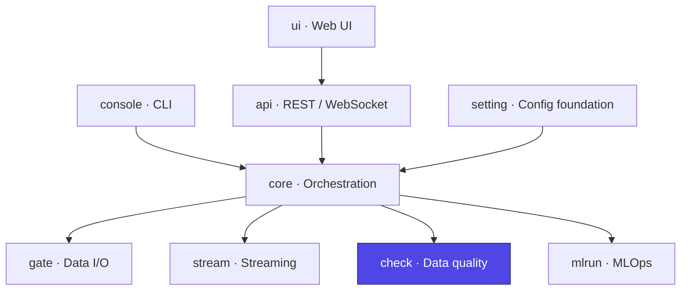

# Ducta Check

> **The data-quality engine of Ducta.** It runs declarative, engine-agnostic quality checks (Pandas **or** Spark) at two points in a node's lifecycle — pre-execution **sanity checks** on inputs and post-execution **data-quality checks** on outputs — and enforces **Quality Gates** that can block, warn, or skip downstream work based on the results.

## At a glance

| | |
|---|---|
| **Purpose** | Validate data before/after each node and gate the pipeline on the results |
| **Layer** | Data quality |
| **Depends on** | `setting` (node/quality schemas) |
| **Used by** | `core` (node quality phases), `console`, `api` (quality endpoints) |
| **Key entry points** | `SanityPhaseRunner`, `ValidationPhaseRunner`, `QualityGateEvaluator`, `register_check`, `DFAdapter` |
| **Install** | Bundled with the core engine (`pip install ducta`) |

## Where it fits



---

## 1. Overview

### For Non-Technical Users
Bad data quietly corrupts everything built on top of it. Ducta Check is the **inspection station** on the assembly line:
*   **Checks the data before and after each step** — is it empty, are values missing, is the schema what we expected, did the numbers drift from yesterday?
*   **Decides what to do about problems** — a "quality gate" can stop the pipeline, raise a warning, or skip only the steps that depend on the bad data.
*   **Keeps a record** of every inspection so teams can see quality trends and audit what happened.

### For Technical Users
Ducta Check is the validation layer, implementing:
*   **Engine-agnostic checks**: a `DFAdapter` normalizes counts, schema, nulls, percentiles, anti-joins, and sampling across Pandas and Spark, so every check runs identically on both (`core.py`).
*   **Extensible registry**: checks self-register via `@register_check`, and `load_quality_extensions` imports user modules to add custom checks (`core.py`, `checks/`).
*   **Two-phase runners**: `SanityPhaseRunner` (pre-execution, fail-fast) and `ValidationPhaseRunner` (post-execution, gate-aware) orchestrate check execution and reporting (`engine.py`).
*   **Quality Gates**: `QualityGateEvaluator` computes a weighted score and evaluates `max_errors`, `max_warnings`, `min_pass_rate`, `score_threshold`, and `required_checks`, producing a `GateResult` with a `behavior` (`skip_downstream` | `stop_all` | `warn_only`) (`gate.py`).
*   **Profiles & auto-tuning**: reusable named check bundles and `ThresholdAdvisor`/`apply_auto_tune` for data-driven thresholds (`profiles.py`, `advisor.py`).
*   **Persistence**: `QualityOutputManager` + pluggable `StorageBackend`s persist reports (parquet/delta/json/csv) with a `QualityService` facade (`output_manager.py`, `storage.py`, `service.py`).

### Built-in checks
`empty_dataset`, `null_rate`, `schema`, `schema_drift`, `row_count`, `duplicates`, `range`, `referential_integrity`, `cross_table_referential`, `anomaly_detection`, `incremental_volume`, `freshness`, `drift_detection`, `statistical`, `dataset_completeness`, `business_rules` — plus any custom `@register_check`.

---

## 2. Configuration & Schemas

Checks are configured per node via the `sanity_checks` (pre) and `data_quality` (post) blocks (validated in `ducta.setting.schemas`). A gate can be attached at either level or globally under `global_config.quality.gate`.

*   **`sanity_checks`**: `enabled`, `fail_fast`, `input_index`, `profile`, `checks: {name: config}`, optional `sanity_gate`.
*   **`data_quality`**: `enabled`, `fail_fast`, `dataset_name`, `profile`, `checks: {name: config}`, optional `quality_gate`, `output`.
*   **Gate keys**: `max_errors`, `max_warnings` (`-1` = unlimited), `min_pass_rate`, `score_threshold`, `score_weights`, `required_checks`, `behavior`.
*   **`output`**: `enabled`, `format`, `write_mode`, `partition_by`, `per_node`, `global_summary`.

Precedence: node-level config always wins over profile defaults, which win over global defaults.

---

## 3. Configuration Examples

```yaml
# global_config.yaml — reusable profiles + a default gate
quality:
  extensions: ["myproject.custom_checks"]   # auto-loaded @register_check modules
  profiles:
    bronze_defaults:
      checks: {empty_dataset: {}, null_rate: {column: "id", max: 0.0}}
  gate:
    max_errors: 0
    min_pass_rate: 0.95
    behavior: "skip_downstream"

# nodes.yaml — a node with both phases + persisted report
clean_sales:
  module: "myproject.nodes"
  function: "clean_sales"
  input: ["raw_sales"]
  output: ["core.analytics.sales_clean"]
  sanity_checks:
    profile: "bronze_defaults"
    fail_fast: true
  data_quality:
    fail_fast: false
    checks:
      row_count: {min: 1000}
      range: {column: "amount", min: 0}
      duplicates: {columns: ["id"]}
    quality_gate:
      required_checks: ["duplicates"]
      score_threshold: 0.9
    output:
      enabled: true
      format: "parquet"
```

---

## 4. Python Quickstart

### Step 1: Run a check directly via the adapter
```python
import pandas as pd
from ducta.check import DFAdapter, QUALITY_CHECKS_REGISTRY

df = pd.DataFrame({"id": [1, 2, 2, None]})
adapter = DFAdapter(df)                       # works for Spark too
check = QUALITY_CHECKS_REGISTRY["null_rate"]()
result = check.run(df, {"column": "id", "max": 0.0}, adapter)
print(result.passed, result.message)
```

### Step 2: Run the post-execution validation phase
```python
from ducta.check import ValidationPhaseRunner

runner = ValidationPhaseRunner(context=context, fail_fast=False)
report = runner.run(
    dataset_name="sales_clean",
    df=result_df,
    config={"checks": {"row_count": {"min": 1000}, "duplicates": {"columns": ["id"]}}},
)
print(report.passed, report.score, report.errors_count)
```

### Step 3: Evaluate a Quality Gate
```python
from ducta.check import QualityGateEvaluator

gate = QualityGateEvaluator.from_config(
    report,
    node_gate_cfg={"max_errors": 0, "required_checks": ["duplicates"]},
)
print(gate.action, gate.behavior, gate.triggered_rules)   # e.g. GateAction.BLOCK ...
```

### Step 4: Register a custom check
```python
from typing import ClassVar, FrozenSet

from ducta.check import register_check, BaseQualityCheck

@register_check("positive_amounts")
class PositiveAmountsCheck(BaseQualityCheck):
    # Optional, but worth declaring: preflight uses it to reject a misspelled
    # parameter before the run. Without it, `positive_amounts: {colum: amount}`
    # validates clean and the check then runs against a column that is None.
    # `enabled`, `type` and `severity` are always accepted; omit CONFIG_PARAMS
    # entirely and only the check's *name* is validated.
    CONFIG_PARAMS: ClassVar[FrozenSet[str]] = frozenset({"column"})

    def run(self, df, config, adapter, context_datasets=None):
        bad = adapter.filter_where(f"{config['column']} < 0")
        return self._create_result(passed=bad == 0, message=f"{bad} negative rows")
```

`ducta config validate` reports, before anything runs and without a Spark
session: check names that are not in the registry, parameters a check does not
accept, and a `quality_gate.behavior` that would silently fall back. A check
name typo used to surface at runtime as *"Quality gate blocked"* — a verdict
about your data, for a mistake in your config.

### Step 5: Run + persist against a file (service facade)
```python
from ducta.check import QualityService

# Runs checks on a local file, persists the report, and returns it as a dict.
report = QualityService.run_checks(
    input_path="data/sales.parquet",
    format="parquet",
    config_path="config/checks.yaml",
    workspace=".",
)
trend = QualityService.get_trend("sales", workspace=".")   # historical scores
```
