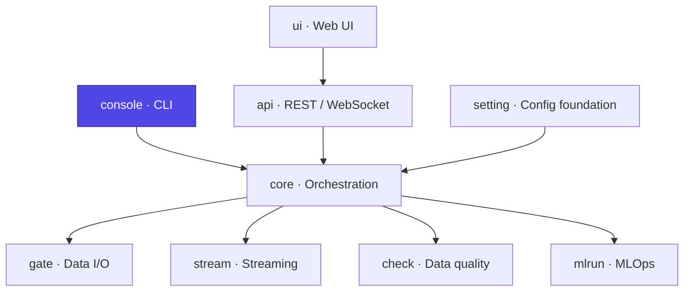

# Ducta Console

> **The command-line interface of Ducta — the `ducta` executable.** It parses arguments, discovers and validates configuration, dispatches to the execution engine, scaffolds new projects from templates, and renders rich, developer-friendly output and error diagnostics.

## At a glance

| | |
|---|---|
| **Purpose** | Human/CI entry point: run pipelines, scaffold projects, inspect configs and quality |
| **Layer** | Interface (CLI) |
| **Depends on** | `core`, `setting`, `check` |
| **Used by** | End users & CI (the `ducta` command) |
| **Key entry points** | `ducta` console script → `UnifiedCLI`, subcommands (`start`, `stream`, `template`, `quality`, …) |
| **Install** | Bundled with the core engine (`pip install ducta`) |

## Where it fits



---

## 1. Overview

### For Non-Technical Users
Ducta Console is the **control panel you type into**. From a single `ducta` command you can start a pipeline, watch a live stream, generate a ready-to-run project, check data quality, and manage models — with clear, color-coded output that explains what happened and what to do when something goes wrong.

### For Technical Users
Ducta Console is the CLI/UX layer, implementing:
*   **Unified dispatch**: `UnifiedCLI` maps each subcommand to a `(validator, handler)` pair, restores the working directory no matter how a handler exits, and translates failures into stable `ExitCode`s (`cli.py`).
*   **Argument parsing**: a composed `UnifiedArgumentParser` builds the full subcommand tree (`parser.py`).
*   **Project discovery**: `ConfigManager` finds the project a command works on — the nearest `ducta.yaml` with `version: 2` from `--base-path` (or the cwd) upwards — runs the command from its root, and reports a missing project with how to create one (`config.py`).
*   **Validation**: field/enum/JSON/date validators for command-line arguments (`validation.py`); project files are validated by `ducta.setting.project_loader`.
*   **Execution bridge**: `load_context(path, env)` builds a project's `Context`; thin wrappers construct a `PipelineExecutor` and run batch/streaming pipelines (`execution.py`).
*   **Project scaffolding**: `template.py` generates runnable projects (`ducta.yaml`, `catalog.yaml` or `catalog/<layer>`, `quality/profiles`, `pipelines/`), verified to compile in every environment; `template_layout.py` cuts the single-file templates into the split layout without losing their comments.
*   **Rich UX**: Rich-based logging, schema formatters, and an `error_analyzer` that turns tracebacks into actionable developer guidance (`ux/`).
*   **Command groups**: execution, quality, config, MLOps (experiment/model), ingestion `init`, and run-certificate `certify` (`commands/`, `mlops_commands.py`).

---

## 2. Commands & Options

Invoked as `ducta <subcommand> [options]`:

| Subcommand | Purpose |
|------------|---------|
| `start`    | Run a batch/ML/hybrid pipeline (`--pipeline`, `--env`, `--start-date`, `--end-date`, `--node`, `--dry-run`, `--validate-only`) |
| `stream`   | `run` / `status` / `stop` a streaming pipeline (`--mode sync\|async`, `--execution-id`) |
| `init project` | Create a project in the recommended layout (`--name`, `--type batch|ml|streaming|hybrid`, `--format yaml|toml|json`, `--path`, `--layout split|single`) |
| `template` | Scaffold a new project (`--template`, `--project-name`, `--output-path`, `--evidence-level`, `--format yaml|toml|json`) |
| `config`   | `validate`, `list-pipelines`, `pipeline-info`, `schema`, `show`, `explain`, `diff`, `convert` |
| `ui` / `server` | Launch the local web UI / API server (`--host`, `--port`, `--no-browser`) |
| `quality`  | `list` / `run` / `report` / `trend` / `score` / `validate-config` for data quality |
| `experiment` | `list` tracked experiments (`--storage-path`) |
| `model`    | `promote` / `gc` registered models |
| `init`     | Scaffold ingestion config (`ingestion`) |
| `certify`  | Inspect and verify Run Certificates |

Global flags include `--log-level`, `--log-file`, `--verbose`, `--quiet`, and `--version`.

---

## 3. Usage Examples

```bash
# Version / help
ducta --version
ducta --help

# Scaffold a new project, then run a pipeline
ducta template --template medallion_basic --project-name my_project
cd my_project
ducta start --env dev --pipeline sales_daily \
  --start-date 2026-01-01 --end-date 2026-01-31

# Validate configuration without executing
ducta start --env dev --pipeline sales_daily --validate-only
ducta config list-pipelines

# Streaming lifecycle
ducta stream run --pipeline events_stream --mode async
ducta stream status --execution-id <id> --format table
ducta stream stop --execution-id <id> --timeout 60

# Data quality on a file
ducta quality run --input data/sales.parquet --format parquet --config checks.yaml

# MLOps
ducta experiment list --storage-path ./mlops_data
ducta model promote sales_model 3 production --env prod

# Run certificate + local UI
ducta certify verify --run-id <run_id>
ducta ui --port 8000
```

---

## 4. Python Quickstart

The CLI is normally used from a shell, but its entry point is programmatically callable:

### Step 1: Invoke the CLI in-process
```python
from ducta.console.cli import UnifiedCLI

cli = UnifiedCLI()
exit_code = cli.run(["start", "--env", "dev", "--pipeline", "sales_daily"])
print(exit_code)   # 0 == ExitCode.SUCCESS
```

### Step 2: Reuse the execution wrappers directly
```python
from ducta.console import execution

execution.run_streaming_pipeline_cli(
    config="path/to/project",     # ducta.yaml, or any file/directory in the project
    pipeline="events_stream",
    mode="async",
    env="dev",
)
```

### Step 3: Load a project
```python
from ducta.console.execution import load_context

context = load_context("path/to/project", env="dev")   # validated; raises on problems
print(sorted(context.pipelines_config))
```

### Step 4: Generate a project template
```python
import argparse
from ducta.console import template

args = argparse.Namespace(
    template="medallion_basic", project_name="my_project", output_path="./my_project",
    list_templates=False, no_sample_code=False,
)
template.handle_template_command(args)
```
