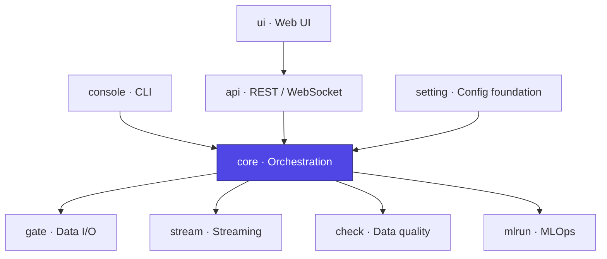

# Ducta Core

> **The pipeline execution engine of Ducta.** It turns a validated `Context` into running work: resolving the node dependency graph, executing nodes in parallel in the correct order, integrating quality gates and MLOps tracking, and emitting a self-hashed (and, with a signing key, tamper-evident) **Run Certificate** for every terminating run.

## At a glance

| | |
|---|---|
| **Purpose** | Orchestrate pipeline execution: DAG resolution, parallel node runs, gates, certificates |
| **Layer** | Orchestration / Execution engine |
| **Depends on** | `setting`, `gate`, `stream`, `check`, `mlrun` |
| **Used by** | `console`, `api` |
| **Key entry points** | `PipelineExecutor`, `BatchExecutor` / `StreamingExecutor` / `HybridExecutor`, `NodeExecutor` |
| **Install** | Bundled with the core engine (`pip install ducta`) |

## Where it fits



---

## 1. Overview

### For Non-Technical Users
Once your pipeline is configured, something has to actually *run* it — in the right order, at the right time, safely. Ducta Core is that **conductor**:
*   **Runs steps in the correct order** and in parallel where it's safe, so pipelines finish faster.
*   **Stops early when something is wrong** — a failed data-quality gate blocks only the affected downstream steps instead of corrupting later results.
*   **Keeps a signed receipt** of every run (what ran, with which config, and the outcome) so results are auditable and reproducible.
*   **Loads your code safely** — node functions are imported through strict validation, never by executing arbitrary paths.

### For Technical Users
Ducta Core is the orchestration layer, implementing:
*   **Specialized executors**: `BatchExecutor`, `StreamingExecutor`, `HybridExecutor`, and the `PipelineExecutor` orchestrator that delegates by pipeline `type` and manages chain-reuse, preflight, and certificates (`executors/`).
*   **Parallel node execution**: `NodeExecutor` + `ParallelCoordinator` drive a DAG-aware thread pool with a thread-safe execution state, per-node timeouts, quality-gate skip cascades, and structured per-node tracing (`execution/`).
*   **Dependency resolution**: explicit `dependencies` merged with dataset-inferred edges, cycle detection, and topological sorting (`dependency_resolver.py`, `dependency_inference.py`, `pipeline_dependency_resolver.py`).
*   **Validation & preflight**: DAG/schema validation and a configuration preflight that fails fast with clear errors before any node runs (`pipeline_validator.py`, `split_validator.py`, `preflight.py`).
*   **MLOps integration**: auto-detection of ML workloads, MLflow tracking, and experiment/run lifecycle wiring (`mlops_integration.py`, `mlops_auto_config.py`, `mlflow_node_executor.py`, `ml_context.py`).
*   **Security & integrity**: `SecureModuleImporter` (whitelist prefixes, path-traversal guards, bounded cache) and HMAC-signed, hash-verified `RunCertificate`s (`import_security.py`, `certificate.py`).
*   **Resources & resilience**: managed resource lifecycle, retry policy, and hyperparameter sweep expansion (`resource_manager.py`, `resilience.py`, `sweep.py`).

---

## 2. Configuration & Schemas

Core does not read project files — it consumes the `Context` that `ducta.setting.project_loader` compiles from `ducta.yaml`, `catalog.yaml` and `pipelines/*.yaml`. Its behavior is driven by the engine settings (`settings:` in `ducta.yaml`, compiled into `global_config`) and per-node/per-pipeline blocks:

*   **`max_parallel_nodes`**: Thread-pool width for parallel node execution.
*   **`execution_timeout_seconds` / `node_timeout_seconds`**: Whole-pipeline and per-node time limits (capped at 24h).
*   **`preflight_enabled`** (*bool*, default `true`): Run configuration preflight before execution.
*   **`run_certificate_dir`**: Where Run Certificates are written. See "Ducta storage convention" below for the default.
*   **`evidence_level`** (`off` | `record` | `required` | `signed`, default `record`): How much evidence each run must leave — the project's choice. `off` writes no certificate; `record` writes one and only warns if it cannot; `required` fails a run that cannot write its certificate; `signed` also requires an HMAC signature, and preflight fails without a key. Recorded inside the certificate, so `certify verify` holds a `signed` certificate to that policy.
*   **`certificate_signing_key`** / `DUCTA_CERTIFICATE_KEY` env: Optional HMAC key for certificate attribution (prefer the env var).
*   **`mlops_enabled` / `mlops_required`**: Toggle experiment tracking and whether its failure aborts the run.
*   **`random_seed`**: Global reproducibility seed applied at pipeline start.
*   **`chain.reuse_materialized` / `chain.staleness_check`**: Skip already-materialized upstream pipelines in a `depends_on` chain. Reuse is refused unless the dates, the config fingerprint, the node modules and (with `staleness_check`, on by default) the input mtimes all still match what produced those outputs.
*   **`chain.on_gate_blocked`** (`stop` | `continue`, default `stop`): What a blocked quality gate in an *upstream* chain step does to the rest of the chain. `stop` aborts it; `continue` runs on, which means the downstream pipelines read whatever an earlier run left on disk.
*   **`chain.state_dir`**: Where chain-state markers (the date range a batch pipeline last ran, for `reuse_materialized`) are written. See "Ducta storage convention" below.

Per-node quality comes from dataset contracts and a node's `input_checks` (compiled into `sanity_checks`, pre-execution) and its `quality` block (compiled into `data_quality`, post-execution); ML behavior from the pipeline `split` and `hyperparams` blocks. A node function receives `start_date`/`end_date` only if it declares them (or `**kwargs`).

### Ducta storage convention

Every directory Ducta itself writes to — as opposed to a node's own data output — is scoped by `${output_path}/${environment}`, exactly like a node's own output paths are (`${output_path}/${environment}/bronze/...`, etc.). This keeps everything for one environment under one subtree instead of scattering framework bookkeeping at the project root, where it reads as clutter with no indication of which environment it belongs to.

| What                          | Setting                | Default                                          | Visible? |
|--------------------------------|-------------------------|---------------------------------------------------|----------|
| Quality reports/baselines/history | `settings.quality.output.base_path` | `${output_path}/${environment}/quality` (an existing legacy `.quality` there is kept, so its history carries over) | yes — a project may want to browse or ship these |
| Run certificates               | `run_certificate_dir`   | `${output_path}/${environment}/.ducta/runs`        | no — hidden, framework bookkeeping |
| Chain-state markers            | `chain.state_dir`       | `${output_path}/${environment}/.ducta/chain_state` | no — hidden, framework bookkeeping |
| Run-lock files / leases       | `run_lock.dir`          | `${output_path}/${environment}/.ducta/locks`       | no — hidden, framework bookkeeping |

A value that doesn't itself reference `${environment}` (a fixed custom or legacy path) is still scoped per environment automatically — the resolved environment is appended as a path segment — so two environments can never collide in the same directory even with a non-default setting. See `CoreSettings._resolve_scoped_dir` for the resolution logic, and `PipelineExecutor._load_chain_state`/`certificate_dir` for the backward-compatible fallbacks that still read markers/certificates written under Ducta's pre-convention defaults (`.ducta/runs`, `.ducta/chain_state`, relative to the project root).

### Run lock — one writer per output

A run takes an exclusive lock on **every output dataset** it will write before
it reads any data, and releases it when it ends. A second run touching any of
those outputs — an overlapping orchestrator retry, the same backfill launched
twice, a different pipeline writing the same table — does not start: it fails
with `PipelineLockedError` (CLI exit code **7**), naming the run that holds the
lock. Nothing ran, so no certificate is written.

```yaml
run_lock:
  enabled: true          # default
  backend: local         # local | storage
  on_conflict: fail      # fail | wait
  wait_timeout_seconds: 600
  ttl_seconds: 300       # storage backend only
  dir: s3://bucket/ducta-locks   # optional; default ${output_path}/${environment}/.ducta/locks
```

* `local` is an OS lock (`flock`/`msvcrt`): released by the OS when the holding
  process dies, so a crash never leaves a lock to clear by hand. One host only.
* `storage` is a lease renewed every `ttl_seconds/3`, on a shared filesystem
  (exclusive create) or S3 (conditional writes). A holder that dies stops
  renewing and the lease can be taken over after `ttl_seconds`. If a running
  holder ever fails to renew, the certificate records it as an evidence gap.

### Timeouts that stop the work

`node_timeout_seconds` and `execution_timeout_seconds` (the whole run) stop the
work, not only the bookkeeping. On a timeout the node's **Spark jobs are
cancelled on the cluster** (each node's jobs carry a tag unique to the run and
node), its **dataset writes are refused**, and the certificate records the gap.
A Python thread cannot be killed, so pure-Python work that never touches Spark
or a writer may still run to completion in the background — it just cannot
land output. For long pure-Python nodes set `run_in_process: true`: they run in
their own process, which is terminated on timeout. Before, `execution_timeout_seconds`
was only a polling cap and a run could exceed it indefinitely.

### Evidence at batch cost

The default `fingerprint_mode: auto` keeps the certificate's cost proportional
to what the run processed, never to the size of a table's history:

| Dataset | Fingerprint | Cost |
|---|---|---|
| Delta input | table id + commit version (`delta-version/v1`) | transaction log only, no scan |
| Input with `incremental: {column: …}` | every row of the run's date window | the window |
| Other input ≤ `fingerprint_exact_max_bytes` (10 GiB) | every row | the dataset |
| Other input above it | deterministic sample, recorded as such | a scan, no shuffle |
| Output | every row of the written batch + Delta commit metrics | the batch (already cached) |

`certify verify --reproduce` reads each Delta input at the version the
certificate recorded (`versionAsOf`), so a reproduction is not confused by
commits made since. `exact`, `exact_crypto`, `sample` and `schema` remain
available to force one strategy.

---

## 3. Configuration Examples

```yaml
# ducta.yaml — core-relevant settings
version: 2
project: sales
paths: {input: data, output: data}
settings:
  max_parallel_nodes: 4
  node_timeout_seconds: 1800
  preflight_enabled: true
  evidence_level: record
  run_certificate_dir: "${paths.output}/${env}/.ducta/runs"   # default — usually left unset
  random_seed: 42
  chain:
    reuse_materialized: true      # skip up-to-date upstream pipelines
    staleness_check: true         # also require outputs newer than inputs (default)
    on_gate_blocked: stop         # a blocked gate upstream aborts the chain (default)
    state_dir: "${paths.output}/${env}/.ducta/chain_state"   # default — usually left unset
```

```yaml
# pipelines/sales.yaml — a node with checks on its input and its output
nodes:
  clean_sales:
    run: myproject.nodes:clean_sales
    inputs: {raw: raw_sales}
    outputs: [core.analytics.sales_clean]
    retry: 2
    input_checks:
      raw_sales:
        checks: {empty_dataset: true}
    quality:
      fail_fast: false
      checks: {null_rate: {columns: [id], threshold: 0.0}}
```

```bash
# Sign certificates for attribution (optional)
export DUCTA_CERTIFICATE_KEY="a-long-random-secret"
```

---

## 4. Python Quickstart

### Step 1: Build an executor from a Context
```python
import ducta

context = ducta.load_project("path/to/project", env="dev")
executor = ducta.PipelineExecutor(context)
```

### Step 2: Run a pipeline
`run_pipeline` selects the right specialized executor by type, runs preflight, executes the DAG in parallel, and emits a Run Certificate:

```python
executor.run_pipeline(
    "sales_daily",
    start_date="2026-01-01",
    end_date="2026-01-31",
)
```

### Step 3: Run a dependency chain with reuse
`run_pipeline_chain` resolves the transitive `depends_on` (explicit ∪ inferred) chain and skips already-materialized upstream pipelines:

```python
executor.run_pipeline_chain(
    "gold_report",
    reuse_upstream=True,   # skip up-to-date ancestors
    rerun_all=False,
)
```

### Step 4: Verify a Run Certificate
```python
from pathlib import Path
from ducta.core import verify_certificate, resolve_signing_key

key = resolve_signing_key(context)   # None if unsigned
result = verify_certificate(Path(".Ducta/runs/<run_id>/certificate.json"), key)
print(result.ok, result.reason, result.signature)   # e.g. True "hash matches and signature valid" valid
```

### Step 5: Manage streaming executions
```python
eid = executor.run_streaming_pipeline("events_stream", mode="async")
print(executor.get_streaming_pipeline_status(eid))
executor.stop_streaming_pipeline(eid, graceful=True)
executor.shutdown()   # staged cleanup: streams → pools → memory
```
