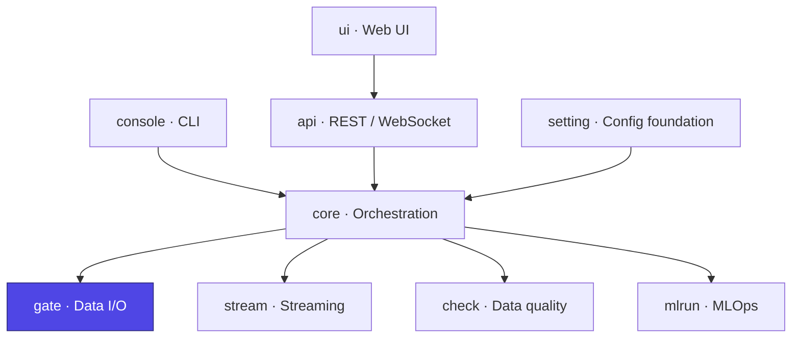

# Ducta Gate

> **The secure, centralized Input/Output (I/O) engine of Ducta.** It abstracts physical storage and database interactions into a unified, high-performance interface that seamlessly supports **Apache Spark**, **Pandas**, and **Polars** DataFrames.

## At a glance

| | |
|---|---|
| **Purpose** | Unified, secure DataFrame read/write across formats and engines, plus a JDBC gateway |
| **Layer** | Physical I/O engine |
| **Depends on** | `setting` (schemas / `Context`), `mlrun` (data fingerprinting) |
| **Used by** | `core` (node input loading and output persistence) |
| **Key entry points** | `InputLoader`, `DataOutputManager`, `ConnectionManager`, `handoff` |
| **Install** | `pip install "ducta[spark]"` (add `database` for JDBC sources) |

## Where it fits



---

## 1. Overview

### For Non-Technical Users
In modern data platforms, data lives across disjointed locations (such as databases, spreadsheets, and cloud storage) and in different formats. Ducta Gate serves as the **secure delivery gateway** for your data pipelines:
*   **Concurrently fetches** data from multiple sources so your workflows start faster.
*   **Monitors consistency** by checking signatures (fingerprints) to ensure data has not unexpectedly changed since the last run.
*   **Safely stores** your processed results, preventing unauthorized operations or unsafe database queries.

### For Technical Users
Ducta Gate acts as the physical layer of the Ducta ecosystem, implementing:
*   **Unified DataFrame I/O**: Simplifies data reading and writing across formats while auto-converting between Pandas, Polars, and Spark.
*   **In-Memory Lifecycle Optimization**: Skips disk I/O between dependent nodes by caching Spark DataFrames in RAM (`MEMORY_AND_DISK`) using the `handoff` mechanism.
*   **Robust Security**: Evaluates SQL queries through AST parsing (`sqlglot`) to block write/modify operations (e.g., `DROP`, `DELETE`, `INSERT`) at the gate level.
*   **Declarative JDBC Gateway**: Dynamically downloads and registers required database driver JARs (e.g., PostgreSQL, SQL Server, Snowflake) based on clean configuration files.

---

## 2. Configuration & Schemas

Ducta Gate configurations are parsed and validated via Pydantic schemas in the `ducta.setting.schemas` module.

### Global I/O Settings
Configure the engine's behavior under the `global_config` block:
*   **`mode`** (*local* | *distributed*): Controls local directory creation vs. cloud storage defaults.
*   **`in_memory_handoff`** (*boolean*, default `false`): Enables memory caching for sequential nodes. **Mind the memory profile, which differs by engine:** Spark frames are persisted `MEMORY_AND_DISK`, so they spill rather than exhaust the heap. Pandas frames have no such valve — each handed-off frame is held as a deep copy for the whole run (and `take()` returns another copy per read), with no eviction once the last consumer has read it. Peak memory therefore grows with the number of handed-off nodes, so enable it for pandas pipelines only when the working set comfortably fits in RAM.
*   **`max_input_workers`** (*integer*): Concurrency limit for parallel reading.
*   **`enable_data_fingerprinting`** (*boolean*): Generates dataset hashes for data quality auditing.
*   **`fingerprint_policy`** (*record* | *warn* | *fail*): Severity policy when data drift is detected.

### Dataset Mappings
*   **Inputs (`InputSchema`)**: Defines source datasets. Supports `format` (CSV, Parquet, Delta, JSON, XML, ORC, Avro, Query, etc.), `filepath`, `options` (custom properties), and `schema`.
*   **Outputs (`OutputSchema`)**: Defines serialization targets. Keys **must** follow the `schema.sub_folder.table_name` pattern. Supports `format`, `filepath` (auto-resolved from output path if omitted), `write_mode` (overwrite, append, ignore, error), and `options`.

---

## 3. Configuration Examples

Below is how the configurations are structured. Notice that `input_path` and `output_path` are defined under `global_config` (as required by `GlobalConfigSchema`) and are automatically interpolated into dataset filepaths using the `${input_path}` and `${output_path}` variables.

### YAML (`global_config.yaml` & configs)
```yaml
# global_config.yaml
input_path: "data/raw"
output_path: "data/processed"
mode: "local"
in_memory_handoff: true
fingerprint_policy: "warn"
max_input_workers: 4

# inputs.yaml
user_records:
  format: "csv"
  filepath: "${input_path}/users.csv"
  options:
    header: "true"
    inferSchema: "true"
sales_data:
  format: "parquet"
  filepath: "${input_path}/sales.parquet"

# outputs.yaml
core.analytics.cleaned_users:
  format: "parquet"
  schema: "core"
  table_name: "users_clean"
  # filepath resolves to: data/processed/dev/core/analytics/users_clean (under dev env)
```

### TOML
```toml
# global_config.toml
input_path = "data/raw"
output_path = "data/processed"
mode = "local"
in_memory_handoff = true
fingerprint_policy = "warn"
max_input_workers = 4

# inputs.toml
[user_records]
format = "csv"
filepath = "${input_path}/users.csv"
options = { header = "true", inferSchema = "true" }

[sales_data]
format = "parquet"
filepath = "${input_path}/sales.parquet"

# outputs.toml
[core.analytics.cleaned_users]
format = "parquet"
schema = "core"
table_name = "users_clean"
```

### JSON
```json
{
  "global_config": {
    "input_path": "data/raw",
    "output_path": "data/processed",
    "mode": "local",
    "in_memory_handoff": true,
    "fingerprint_policy": "warn",
    "max_input_workers": 4
  },
  "input_config": {
    "user_records": {
      "format": "csv",
      "filepath": "${input_path}/users.csv",
      "options": {
        "header": "true",
        "inferSchema": "true"
      }
    },
    "sales_data": {
      "format": "parquet",
      "filepath": "${input_path}/sales.parquet"
    }
  },
  "output_config": {
    "core.analytics.cleaned_users": {
      "format": "parquet",
      "schema": "core",
      "table_name": "users_clean"
    }
  }
}
```

---

## 4. Python Quickstart


### Step 1: Load Context & Initialize Gate
Integrate your configuration with the `Context` class from `ducta.setting`:

```python
from pathlib import Path
from ducta.setting.contexts import Context
from ducta.gate import InputLoader, DataOutputManager

# Load and validate configs
context = Context(
    global_config=Path("config/global_config.yaml"),
    pipelines_config=Path("config/pipelines.yaml"),
    nodes_config=Path("config/nodes.yaml"),
    input_config=Path("config/inputs.yaml"),
    output_config=Path("config/outputs.yaml")
)

# Initialize Gate modules
loader = InputLoader(context)
writer = DataOutputManager(context)
```

### Step 2: Parallel Input Loading
Load inputs concurrently for a pipeline processing node:

```python
node = {
    "name": "prepare_analytics",
    "input": ["user_records", "sales_data"],
    # Check every input resolves before loading any of them.
    "fail_fast": True,
    # ...and what that check means when one does not. "skip" (the default)
    # raises MissingDependencyError, which the DAG coordinator treats as a skip
    # and cascades onto this node's descendants; "fail" aborts the run instead.
    # `fail_fast` only decides *whether* to pre-check — it never decided this.
    "on_missing_input": "skip",
}

# Concurrently loaded and validated
user_df, sales_df = loader.load_inputs(node)
```

### Step 3: Output Serialization
Save DataFrames securely (Ducta Gate converts Polars/Pandas data to Spark automatically):

```python
node = {
    "name": "prepare_analytics",
    "output": ["core.analytics.cleaned_users"]
}

# Persists output and registers it in memory (handoff) for downstream tasks
writer.save_output(env="dev", node=node, dataframe=user_df)
```

### Step 4: Secure Database Connection (JDBC Gateway)
Define database credentials and query SQL databases securely:

```python
import os
from ducta.gate.gateway import ConnectionManager

# Set environmental credentials (required by Gateway)
os.environ["POSTGRESQL_USER"] = "admin"
os.environ["POSTGRESQL_PASSWORD"] = "secret"

# Initialize using sources config (downloads driver JAR dynamically)
manager = ConnectionManager(config_path=Path("sources.yaml"))
connection = manager.get("analytics_db")

# Only SELECT/WITH statements are executed. AST parser validates safety.
safe_query = "SELECT id, name FROM dev.users"
df = connection.read(safe_query)
```
