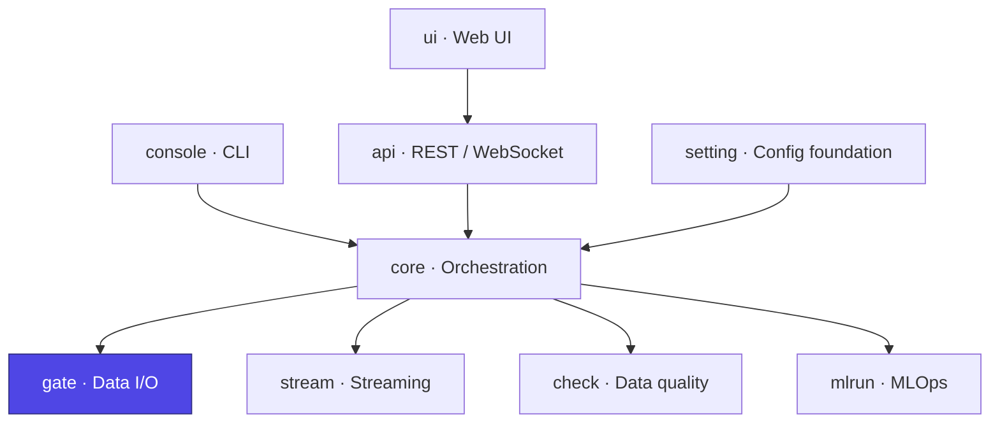

# Ducta Gate

> **The secure, centralized Input/Output (I/O) engine of Ducta.** It abstracts physical storage and database interactions into a unified, high-performance interface that seamlessly supports **Apache Spark**, **Pandas**, and **Polars** DataFrames.

## At a glance

| | |
|---|---|
| **Purpose** | Unified, secure DataFrame read/write across formats and engines, plus a JDBC gateway |
| **Layer** | Physical I/O engine |
| **Depends on** | `setting` (schemas / `Context`), `mlrun` (data fingerprinting) |
| **Used by** | `core` (node input loading and output persistence) |
| **Key entry points** | `InputLoader`, `DataOutputManager`, `ConnectionManager`, `handoff` |
| **Install** | `pip install "ducta[spark]"` (add `database` for JDBC sources) |

## Where it fits



---

## 1. Overview

### For Non-Technical Users
In modern data platforms, data lives across disjointed locations (such as databases, spreadsheets, and cloud storage) and in different formats. Ducta Gate serves as the **secure delivery gateway** for your data pipelines:
*   **Concurrently fetches** data from multiple sources so your workflows start faster.
*   **Monitors consistency** by checking signatures (fingerprints) to ensure data has not unexpectedly changed since the last run.
*   **Safely stores** your processed results, preventing unauthorized operations or unsafe database queries.

### For Technical Users
Ducta Gate acts as the physical layer of the Ducta ecosystem, implementing:
*   **Unified DataFrame I/O**: Simplifies data reading and writing across formats while auto-converting between Pandas, Polars, and Spark.
*   **In-Memory Lifecycle Optimization**: Skips disk I/O between dependent nodes by caching Spark DataFrames in RAM (`MEMORY_AND_DISK`) using the `handoff` mechanism.
*   **Robust Security**: Evaluates SQL queries through AST parsing (`sqlglot`) to block write/modify operations (e.g., `DROP`, `DELETE`, `INSERT`) at the gate level.
*   **Declarative JDBC Gateway**: Dynamically downloads and registers required database driver JARs (e.g., PostgreSQL, SQL Server, Snowflake) based on clean configuration files.

---

## 2. Configuration & Schemas

Users declare datasets once in the project's `catalog.yaml` (see
`docs/configuration.rst`). `ducta.setting.project_loader` compiles the catalog
into the two documents Gate reads — `input_config` and `output_config` — with
`path` becoming `filepath` and the `write:` block flattened into
`write_mode`, `merge`, `partition`, … — everything below is what Gate sees at
runtime.

### Engine settings Gate reads
Set under `settings:` in `ducta.yaml` (compiled into `global_config`):
*   **`mode`** (*local* | *databricks* | *distributed*): Controls local directory creation vs. cloud storage defaults.
*   **`in_memory_handoff`** (*boolean*, default `false`): Enables memory caching for sequential nodes. **Mind the memory profile, which differs by engine:** Spark frames are persisted `MEMORY_AND_DISK`, so they spill rather than exhaust the heap. Pandas frames have no such valve — each handed-off frame is held as a deep copy for the whole run (and `take()` returns another copy per read), with no eviction once the last consumer has read it. Peak memory therefore grows with the number of handed-off nodes, so enable it for pandas pipelines only when the working set comfortably fits in RAM.
*   **`max_input_workers`** (*integer*): Concurrency limit for parallel reading.
*   **`enable_data_fingerprinting`** (*boolean*): Generates dataset hashes for data quality auditing.
*   **`fingerprint_policy`** (*record* | *warn* | *fail*): Severity policy when data drift is detected.

### Datasets
*   **Reading**: `format` (CSV, Parquet, Delta, JSON, XML, ORC, Avro, Query, …), `path`, `options`, `schema` (DDL), `read: {version | timestamp}` (Delta time travel), and `incremental: {column: <date column>}` — read only rows with that column between the run's `start_date` and `end_date` (pushed down to the source) and fingerprint only that window.
*   **Writing**: `write: {mode, merge, partition, options, overwrite_strategy, …}`, with `mode` one of overwrite, append, ignore, error, merge. A dataset named `schema.sub_folder.table_name` without a `path` is written to `<paths.output>/<env>/<schema>/<sub_folder>/<table_name>`.

```yaml
# catalog.yaml
user_records:
  format: csv
  path: ${paths.input}/users.csv
  options: {header: true, inferSchema: true}
core.analytics.cleaned_users:           # → data/processed/dev/core/analytics/cleaned_users under --env dev
  format: parquet
  write: {mode: overwrite, partition: [country]}
```

### MERGE / upsert (Delta)

```yaml
# catalog.yaml
gold.sales.customers:
  format: delta
  write:
    mode: merge
    merge:
      keys: [customer_id]                # required
      when_matched: update_all           # update_all | {update: [cols]} | ignore
      when_not_matched: insert_all       # insert_all | ignore
      delete_when: "s._op = 'D'"         # optional (CDC); s = incoming batch, t = target
      schema_evolution: false
```

* The first run creates the table; later runs merge into it.
* Keys match **null-safely** (`<=>`), so re-running the same batch is idempotent
  even for rows with NULL keys.
* Duplicate keys in the incoming batch fail the write **before** merging, naming
  the keys — instead of Delta's "multiple source rows matched".
* Rows flagged by `delete_when` are deleted when matched and never inserted.
* The commit's `operationMetrics` (rows inserted/updated/deleted) are recorded in
  the run certificate. Preflight rejects `merge` on a non-Delta format.
* Needs the `delta-spark` Python package (`pip install "ducta[delta]"`). A local
  session gets the matching Delta jar automatically when any dataset uses
  `format: delta` (override with `settings.delta_package`).

---

## 3. Python Quickstart


### Step 1: Load a project & initialize Gate

```python
import ducta
from ducta.gate import InputLoader, DataOutputManager

context = ducta.load_project("path/to/project", env="dev")   # validated Context

# Initialize Gate modules
loader = InputLoader(context)
writer = DataOutputManager(context)
```

### Step 2: Parallel Input Loading
Load inputs concurrently for a pipeline processing node:

```python
node = {
    "name": "prepare_analytics",
    "input": ["user_records", "sales_data"],
    # Check every input resolves before loading any of them.
    "fail_fast": True,
    # ...and what that check means when one does not. "skip" (the default)
    # raises MissingDependencyError, which the DAG coordinator treats as a skip
    # and cascades onto this node's descendants; "fail" aborts the run instead.
    # `fail_fast` only decides *whether* to pre-check — it never decided this.
    "on_missing_input": "skip",
}

# Concurrently loaded and validated
user_df, sales_df = loader.load_inputs(node)
```

### Step 3: Output Serialization
Save DataFrames securely (Ducta Gate converts Polars/Pandas data to Spark automatically):

```python
node = {
    "name": "prepare_analytics",
    "output": ["core.analytics.cleaned_users"]
}

# Persists output and registers it in memory (handoff) for downstream tasks
writer.save_output(env="dev", node=node, dataframe=user_df)
```

### Step 4: Secure Database Connection (JDBC Gateway)
Define database credentials and query SQL databases securely:

```python
import os
from ducta.gate.gateway import ConnectionManager

# Set environmental credentials (required by Gateway)
os.environ["POSTGRESQL_USER"] = "admin"
os.environ["POSTGRESQL_PASSWORD"] = "secret"

# Initialize using sources config (downloads driver JAR dynamically)
manager = ConnectionManager(config_path=Path("sources.yaml"))
connection = manager.get("analytics_db")

# Only SELECT/WITH statements are executed. AST parser validates safety.
safe_query = "SELECT id, name FROM dev.users"
df = connection.read(safe_query)
```
