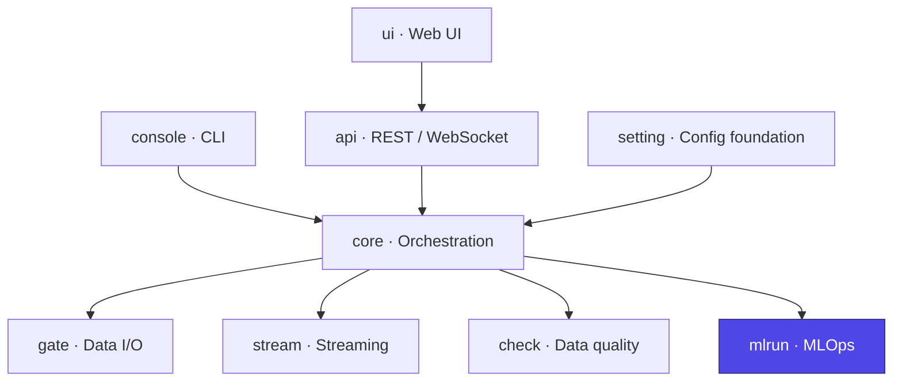

# Ducta Mlrun

> **The MLOps engine of Ducta.** It provides self-contained experiment tracking, a versioned model registry, data/lineage fingerprinting, hyperparameter search, and reproducible dataset splitting — with pluggable storage backends (local filesystem or Databricks Unity Catalog) and an optional MLflow bridge.

## At a glance

| | |
|---|---|
| **Purpose** | Track experiments, version models, fingerprint data, and reproduce ML runs |
| **Layer** | MLOps |
| **Depends on** | Self-contained (optional MLflow / Databricks integrations) |
| **Used by** | `core` (ML/hybrid runs), `gate` (fingerprinting), `setting` (hyperparams) |
| **Key entry points** | `MLOpsContext`, `ExperimentTracker`, `ModelRegistry`, `DataFingerprint`, `split_dataframe` |
| **Install** | `pip install "ducta[mlops]"` |

## Where it fits



---

## 1. Overview

### For Non-Technical Users
Machine-learning work has to be **reproducible and auditable**: which model version is live, what data trained it, what were the metrics, can we recreate last month's run? Ducta Mlrun is the **system of record** for all of that:
*   **Tracks every experiment** — parameters, metrics, and artifacts for each training run.
*   **Versions every model** with stages (`staging`, `production`) and promotion rules.
*   **Fingerprints the data** so a silent change in an input is detectable.
*   **Works locally or in the cloud** without changing your pipeline code.

### For Technical Users
Ducta Mlrun is the ML lifecycle layer, implementing:
*   **Experiment tracking**: `ExperimentTracker` with `Experiment`/`Run`/`Metric` models, buffered metrics, active-run limits, and stale-run cleanup (`experiment_tracking.py`).
*   **Model registry**: `ModelRegistry` with `ModelVersion`, `ModelStage`, and `PromotionPolicy` for governed promotions (`model_registry.py`).
*   **Pluggable storage**: `StorageBackend` registry with `LocalStorageBackend` and `DatabricksStorageBackend`, chosen automatically from the execution mode (`storage.py`, `config.py`).
*   **Concurrency & resilience**: a portable `FileLock` (atomic `O_CREAT|O_EXCL`, stale-lock detection) with a `LockManager`, plus `RetryConfig`/`CircuitBreaker`/`ResourceLimits` (`concurrency.py`, `resilience.py`).
*   **MLflow bridge**: optional `MLflowPipelineTracker` / `MLflowNodeContext` that mirror runs to an MLflow tracking server when enabled (`mlflow.py`).
*   **Reproducibility**: `DataFingerprint` (fast/full lineage hashing), `split_dataframe` (random/stratified/temporal/group), `HyperparamConfig` search specs, and baseline/drift comparison (`fingerprint.py`, `split.py`, `hyperparams.py`, `baseline.py`).
*   **GC**: keep-newest-N / retention-days artifact garbage collection (`gc.py`).

---

## 2. Configuration & Schemas

Mlrun is driven by `MLOpsConfig` (constructed directly, `from_env`, or `from_context`). Key settings:

*   **`backend_type`**: `local` | `databricks` | `distributed` (distributed ≈ databricks).
*   **`storage_path`** (local) / **`catalog` + `schema` + `volume`** (Databricks UC).
*   **`registry_path` / `tracking_path`**: sub-paths under the backend base.
*   **`max_active_runs`, `metric_buffer_size`, `auto_flush_metrics`, `auto_cleanup_stale`, `stale_run_age_seconds`**: tracker behavior.
*   **`enable_retry`, `max_retries`, `retry_delay`, `enable_circuit_breaker`**: resilience.
*   **`model_retention_days`, `max_versions_per_model`**: registry retention.

From a pipeline `Context`, storage location is resolved with a 4-tier fallback (`base_path` → `global_settings.mlops_path` → `output_path/<env>/<pipeline>` → `output_path/<env>`); if none resolve safely, MLOps stays uninitialized rather than writing to the wrong place.

### Relevant environment variables
`Ducta_MLOPS_BACKEND`, `Ducta_MLOPS_PATH`, `DATABRICKS_CATALOG`, `DATABRICKS_SCHEMA`, `DATABRICKS_VOLUME`, `Ducta_MLOPS_MAX_ACTIVE_RUNS`, `Ducta_MLFLOW_ENABLED`, and the rest of the `Ducta_MLOPS_*` family.

---

## 3. Configuration Examples

```yaml
# global_settings.yaml — mlrun-relevant keys
mlops_enabled: true
mlops_required: false        # true = abort the run if MLOps init fails
project_name: "sales_forecast"
default_model_version: "v1"

# pipelines.yaml — an ML pipeline with a declarative split
train_model:
  type: ml
  nodes: ["build_features", "train"]
  split: {method: "temporal", time_col: "event_date", test_size: 0.2}
  hyperparams: {learning_rate: 0.05, n_estimators: 300}
```

```bash
# Point tracking at a local dir or a cloud backend
export Ducta_MLOPS_BACKEND=local
export Ducta_MLOPS_PATH=./mlops_data
# Or mirror to MLflow:
export Ducta_MLFLOW_ENABLED=true
```

---

## 4. Python Quickstart

### Step 1: Build an MLOps context
```python
from ducta.mlrun import MLOpsContext, MLOpsConfig

# From explicit config…
ctx = MLOpsContext.from_config(MLOpsConfig(backend_type="local", storage_path="./mlops_data"))
# …or from a pipeline Context (auto backend + path resolution):
# ctx = MLOpsContext.from_context(context, pipeline_name="sales.train_model")
```

### Step 2: Track an experiment run
```python
from ducta.mlrun import RunStatus

tracker = ctx.experiment_tracker
exp = tracker.create_experiment("sales_forecast")
run = tracker.start_run(experiment_id=exp.experiment_id, parameters={"learning_rate": 0.05})
tracker.log_metric(run.run_id, "rmse", 12.4)
tracker.end_run(run.run_id, status=RunStatus.COMPLETED)
```

### Step 3: Register and promote a model
```python
from ducta.mlrun import ModelStage

registry = ctx.model_registry
version = registry.register_model(
    name="sales_model",
    artifact_path="./artifacts/sales_model.pkl",
    artifact_type="model",
    framework="sklearn",
    metrics={"rmse": 12.4},
    experiment_run_id=run.run_id,
)
registry.promote_model(name="sales_model", version=version.version, stage=ModelStage.PRODUCTION)
```

### Step 4: Fingerprint data & split reproducibly
```python
import pandas as pd
from ducta.mlrun import DataFingerprint, split_dataframe

df = pd.read_parquet("data/sales.parquet")
fp = DataFingerprint.from_file_and_df("sales", "data/sales.parquet", df, mode="fast")
print(fp.fingerprint)

# split_config is a dict (or a SplitConfig); returns (train, test) or (train, val, test)
train, test = split_dataframe(
    df, {"method": "temporal", "time_col": "event_date", "test_size": 0.2}, default_seed=42
)
```

### Step 5: Load a hyperparameter search spec
```python
from ducta.mlrun import load_hyperparams_config

hp = load_hyperparams_config("config/ml/hyperparams.yml", pipeline_key="train_model")
print(hp.algorithm, hp.n_trials, hp.cv_folds)
```
