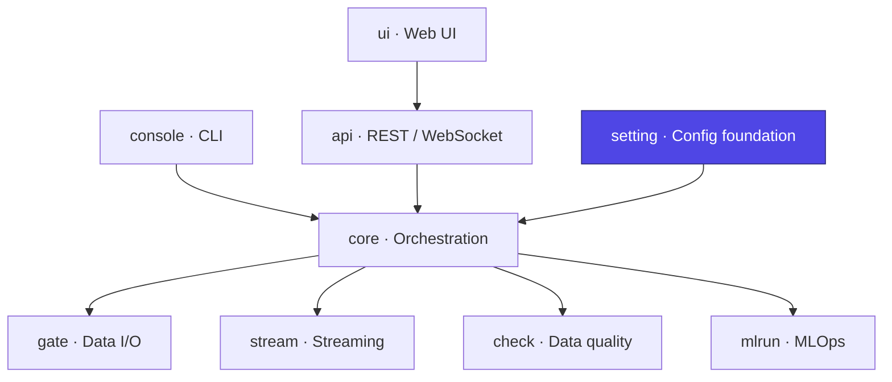

# Ducta Setting

> **The configuration foundation of Ducta.** It reads a project's `ducta.yaml`, `catalog.yaml` and `pipelines/*.yaml`, applies the active environment, validates everything — reporting every problem with its file and line — and builds the **`Context`** object the rest of the framework consumes.

## At a glance

| | |
|---|---|
| **Purpose** | Load → interpolate → validate → model configuration into a typed `Context` |
| **Layer** | Foundation / Configuration |
| **Depends on** | `mlrun` (hyperparams), `check` (quality output types) |
| **Used by** | Every other Ducta module |
| **Key entry points** | `load_project`, `validate_project`, `compile_project`, `Context`, `SparkSessionManager` |
| **Install** | Bundled with the core engine (`pip install ducta`) |

## Where it fits



---

## 1. Overview

### For Non-Technical Users
Every data pipeline needs to know *what* to run, *where* the data lives, and *how* the environment (development vs. production) differs. Ducta Setting is the **control panel** that reads those settings from simple text files and makes sure they are correct *before* anything runs:
*   **Three small files** describe a project: its settings, its datasets, and its pipelines.
*   **Mistakes are caught before anything runs** — a misspelled key is an error naming the file, the line and the likely intended key, never silently ignored.
*   **Adapts to each environment** — `dev`, `sandbox`, `staging` and `prod` state only what differs from the base project.

### For Technical Users
Ducta Setting is the declarative configuration layer of the framework:
*   **Project model** (`project_schema.py`): strict pydantic models for `ducta.yaml` (`ProjectFile`), `catalog.yaml` (`CatalogEntry`) and `pipelines/<name>.yaml` (`PipelineFile`, with `transform`/`ingest`/`stream` node kinds). Unknown keys are errors with a suggestion; `json_schema()` feeds `ducta config schema` and editor completion.
*   **Loader** (`project_loader.py`): reads the files keeping each key's file and line, applies `environments.<env>` as a deep merge (dotted keys address one value), validates the result and the references between files, and **compiles** it to the five engine documents (`global_config`, `pipelines_config`, `nodes_config`, `input_config`, `output_config`) that `Context` and the engine consume.
*   **Migration** (`project_migrate.py`): converts a Ducta 0.2 project (`environment.yaml` + `config/*`) and proves the result compiles to the same documents in every environment. It is the only code that still reads that layout.
*   **Engine settings schema** (`schemas.py`): `GlobalConfigSchema` declares every setting the engine reads — the keys `settings:` accepts — plus the node/pipeline/dataset models the engine documents are validated against.
*   **Variable interpolation** (`interpolator.py`): `${VAR}` substitution from the process environment, refusing secret-looking names, with circular-reference guards.
*   **Environments** (`environments.py`): canonical names (`base`/`dev`/`sandbox`/`staging`/`prod`), aliases (`production` → `prod`, `test` → `sandbox`) and `sandbox_<developer>` variants.
*   **Context** (`contexts.py`): the validated engine documents plus the Spark session, pipelines and nodes accessors.
*   **Spark session lifecycle** (`session.py`): thread-safe, per-config caching with timeout detection, graceful streaming-query shutdown, protected-config guards, and Delta wiring for local sessions.

---

## 2. Configuration

A project is `ducta.yaml` (project, `paths`, `settings`, `environments`),
`catalog.yaml` (every dataset once) and one `pipelines/<name>.yaml` per
pipeline. `docs/configuration.rst` is the full reference.

```yaml
# ducta.yaml
version: 2
project: sales
paths: {input: data/raw, output: data/processed}
settings: {max_parallel_nodes: 4, log_level: INFO}
environments:
  dev: {settings: {max_parallel_nodes: 1, log_level: DEBUG}}
  prod: {settings: {mlops_required: true}}
```

```yaml
# catalog.yaml
raw_sales:
  format: csv
  path: ${paths.input}/sales.csv
  options: {header: true, inferSchema: true}
core.analytics.sales_clean:
  format: parquet
  write: {mode: overwrite}
```

```yaml
# pipelines/sales_daily.yaml
nodes:
  clean_sales:
    run: myproject.nodes:clean_sales
    inputs: {raw: raw_sales}
    outputs: [core.analytics.sales_clean]
```

### What the loader produces

| Engine document | From |
|---|---|
| `global_config` | `settings`, plus `project_name`, `input_path`/`output_path` from `paths` |
| `pipelines_config` | each pipeline file's keys, with `nodes` as the list of its node names |
| `nodes_config` | each node: `run` → `module`/`function`, `inputs`/`outputs` → `input`/`output`, `after` → `dependencies`, `quality` → `data_quality`, contracts and `input_checks` → `sanity_checks` |
| `input_config` / `output_config` | each catalog entry, `path` → `filepath`, `write` flattened into `write_mode`/`merge`/`partition` |

Placeholders `${paths.input}`, `${paths.output}` and `${env}` compile to the
engine's `${input_path}`, `${output_path}` and `${environment}`.

---

## 3. Python Quickstart

### Step 1: Load a project
```python
import ducta

context = ducta.load_project("my_project", env="prod")   # nearest ducta.yaml at or above
print(context.list_pipeline_names())
pipeline = context.get_pipeline("sales_daily")
```

### Step 2: Validate and compile without a Context
```python
from pathlib import Path
from ducta.setting.project_loader import ProjectConfigError, compile_project, validate_project

try:
    docs = compile_project(validate_project(Path("my_project"), "prod"))
except ProjectConfigError as exc:
    for problem in exc.problems:      # every problem, each with file:line
        print(problem)
```

### Step 3: Convert a Ducta 0.2 project
```python
from pathlib import Path
from ducta.setting import project_migrate

result = project_migrate.migrate(Path("old_project"))    # verified per environment
project_migrate.write_files(result, Path("/tmp/new_project"))
```

### Step 4: Manage the Spark session
Session creation and caching are handled for you, but can be driven directly:

```python
from ducta.setting import SparkSessionManager

spark = SparkSessionManager.get_or_create_session(mode="local")
info = SparkSessionManager.get_session_info(check_health=True)
SparkSessionManager.cleanup_all()   # graceful shutdown (also runs at exit)
```
