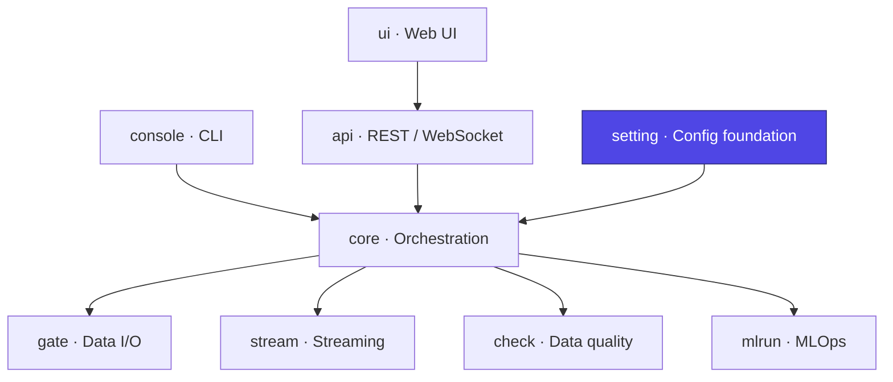

# Ducta Setting

> **The configuration foundation of Ducta.** It loads, interpolates, validates, and models every configuration source a pipeline needs — turning raw YAML / TOML / JSON / Python files into a strongly-typed, environment-aware **`Context`** object that the rest of the framework consumes.

## At a glance

| | |
|---|---|
| **Purpose** | Load → interpolate → validate → model configuration into a typed `Context` |
| **Layer** | Foundation / Configuration |
| **Depends on** | `mlrun` (hyperparams), `check` (quality output types) |
| **Used by** | Every other Ducta module |
| **Key entry points** | `Context`, `ContextFactory`, `ConfigLoaderFactory`, `SparkSessionManager` |
| **Install** | Bundled with the core engine (`pip install ducta`) |

## Where it fits



---

## 1. Overview

### For Non-Technical Users
Every data pipeline needs to know *what* to run, *where* the data lives, and *how* the environment (development vs. production) differs. Ducta Setting is the **control panel** that reads those settings from simple text files and makes sure they are correct *before* anything runs:
*   **Reads many file formats** (YAML, TOML, JSON, or Python) so teams can use whatever they prefer.
*   **Checks for missing required settings early** — a missing required field (e.g. `input_path`) is caught and explained before anything runs. Optional fields are deliberately permissive: unknown/misspelled optional keys are passed through rather than rejected, so a config can carry extra fields consumed elsewhere in the framework without being flagged as an error.
*   **Adapts to each environment** — the same project can behave differently in `dev`, `sandbox`, `staging`, and `prod` from a single set of files.

### For Technical Users
Ducta Setting is the declarative configuration layer of the framework, implementing:
*   **Multi-format loading**: A pluggable `ConfigLoaderFactory` resolves `.yaml`/`.yml`, `.json`, `.toml`, and `.py` sources (plus inline dict/JSON strings), with path-traversal protection and clear per-format errors (`loaders.py`).
*   **Pydantic-validated schemas**: `ConfigSchema` composes `GlobalConfigSchema`, `PipelineSchema`, `NodeSchema`, `InputSchema`, `OutputSchema`, and the quality/ML sub-schemas for fail-fast validation (`schemas.py`).
*   **Variable interpolation**: `${VAR}` substitution with OS-env precedence, circular-reference guards, and selective path-only interpolation for catalogs and streaming nodes (`interpolator.py`).
*   **Environment normalization & fallback chains**: canonical envs (`base`/`dev`/`sandbox`/`staging`/`prod`), aliases, `sandbox_<developer>` variants, and inheritance chains (`environments.py`).
*   **Context construction**: `Context` and specialized `MLContext` / `StreamingContext` / `HybridContext` (via `ContextFactory`), with parallel file loading and inline per-environment overrides (`contexts.py`).
*   **Spark session lifecycle**: thread-safe, per-config caching with timeout detection, graceful streaming-query shutdown, and protected-config guards (`session.py`).
*   **Layered (medallion) projects**: auto-detection or declarative `ducta.*` manifests for `bronze`/`silver`/`gold`/`ml` layers with dependency-ordered execution (`layered_config.py`).

---

## 2. Configuration & Schemas

All configuration is validated by Pydantic models in `ducta.setting.schemas`. A complete project is described by five sources, combined by `ConfigSchema`:

*   **`global_config` (`GlobalConfigSchema`)**: Engine-wide settings — `input_path`, `output_path`, `mode` (`local` | `databricks` | `distributed`), `max_parallel_nodes`, `log_level`, fingerprinting, run certificates, MLOps toggles, and quality/chain sub-blocks.
*   **`pipelines_config` (`PipelineSchema`)**: One entry per pipeline — `type` (`batch` | `ml` | `streaming` | `hybrid`), the ordered `nodes` list, `depends_on` chains, and optional ML `split` / `hyperparams`.
*   **`nodes_config` (`NodeSchema`)**: One entry per node — `module`/`function`, `input`/`output` references, `dependencies`, `retry`/`timeout`, and optional `sanity_checks` / `data_quality` blocks.
*   **`input_config` (`InputSchema`)**: Source datasets — `format`, `filepath` (with `${VAR}` interpolation), `schema`, and format `options`.
*   **`output_config` (`OutputSchema`)**: Serialization targets — `format`, `filepath`, `write_mode` (`overwrite` | `append` | `ignore` | `error` | `merge`), and `options`.

### Environments
`environments.py` defines the canonical set `base`, `dev`, `sandbox`, `staging`, `prod`, common aliases (`production` → `prod`, `test` → `sandbox`), per-developer `sandbox_<name>` variants, and **fallback chains** (e.g. `dev` → `base`, `staging` → `prod` → `base`) so environment-specific files inherit shared defaults.

---

## 3. Configuration Examples

### YAML (five-file convention)
```yaml
# global.yaml
input_path: "data/raw"
output_path: "data/processed"
mode: "local"
max_parallel_nodes: 4
log_level: "INFO"
# Optional inline per-environment overrides (single-file style):
environments:
  dev:     {max_parallel_nodes: 1, log_level: DEBUG}
  prod:    {mlops_required: true}

# config/pipelines.yaml
sales_daily:
  type: batch
  nodes: ["clean_sales", "aggregate_sales"]

# config/nodes.yaml
clean_sales:
  module: "myproject.nodes"
  function: "clean_sales"
  input: ["raw_sales"]
  output: ["core.analytics.sales_clean"]

# config/input.yaml
raw_sales:
  format: "csv"
  filepath: "${input_path}/sales.csv"
  options: {header: "true", inferSchema: "true"}

# config/output.yaml
core.analytics.sales_clean:
  format: "parquet"
  write_mode: "overwrite"
```

### TOML
```toml
# global.toml
input_path = "data/raw"
output_path = "data/processed"
mode = "local"
max_parallel_nodes = 4

[environments.dev]
max_parallel_nodes = 1
log_level = "DEBUG"
```

### JSON
```json
{
  "global_config": {
    "input_path": "data/raw",
    "output_path": "data/processed",
    "mode": "local",
    "max_parallel_nodes": 4
  }
}
```

---

## 4. Python Quickstart

### Step 1: Build a Context
`Context` loads all five sources (in parallel when they are files), interpolates `${VAR}` placeholders, applies environment overrides, and validates everything through Pydantic.

**Environment overrides are not uniform.** `global_config` is deep-merged over the base file, so an environment only states the keys it changes. The other four documents — `input`, `output`, `nodes`, `pipelines` — *replace* their base counterpart entirely when the environment supplies its own. Adding a dataset to the base `input.yaml` therefore has no effect in an environment that ships its own copy; declare it in that environment's file too. Ducta logs which file wins at startup:

```python
from pathlib import Path
from ducta.setting import Context

context = Context(
    global_config=Path("config/global.yaml"),
    pipelines_config=Path("config/pipelines.yaml"),
    nodes_config=Path("config/nodes.yaml"),
    input_config=Path("config/input.yaml"),
    output_config=Path("config/output.yaml"),
    env="dev",            # normalized + fallback-aware
)

print(context.list_pipeline_names())      # ['sales_daily']
pipeline = context.get_pipeline("sales_daily")
```

### Step 2: Specialize the Context
`ContextFactory` inspects declared pipeline types and returns the right specialized context (ML, Streaming, or Hybrid), reusing the already-loaded config for speed:

```python
from ducta.setting import ContextFactory

runtime_context = ContextFactory.create_context(context)
# -> MLContext / StreamingContext / HybridContext / Context
```

### Step 3: Load a non-canonical layout
`FlexibleConfigResolver` resolves single-file bundles, directory conventions, and 2-file quickstart layouts without hardcoding paths:

```python
from pathlib import Path
from ducta.setting import FlexibleConfigResolver

context = FlexibleConfigResolver.resolve_dir(Path("./my_project"), env="dev")
```

### Step 4: Manage the Spark session
Session creation and caching are handled for you, but can be driven directly:

```python
from ducta.setting import SparkSessionManager

spark = SparkSessionManager.get_or_create_session(mode="local")
info = SparkSessionManager.get_session_info(check_health=True)
SparkSessionManager.cleanup_all()   # graceful shutdown (also runs at exit)
```

### Step 5: Detect layered (medallion) projects
```python
from ducta.setting.layered_config import LayeredProjectDetector

detector = LayeredProjectDetector(project_root=Path("."))
if detector.is_layered_project:
    print(detector.get_execution_order())   # e.g. ['bronze', 'silver', 'gold', 'ml']
```
