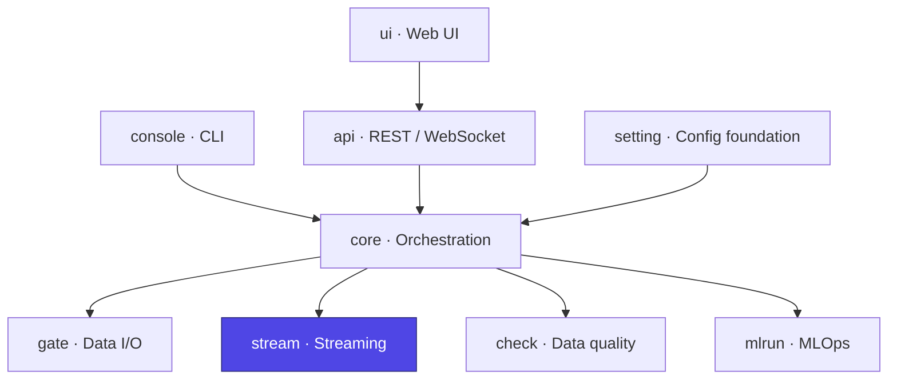

# Ducta Stream

> **The real-time streaming engine of Ducta.** Built on Spark **Structured Streaming**, it turns declarative node configuration into managed streaming queries — reading from Kafka/Kinesis/Delta/files, applying registered transforms, writing to multiple sinks, and supervising the whole pipeline's health and lifecycle.

## At a glance

| | |
|---|---|
| **Purpose** | Run and supervise Spark Structured Streaming pipelines end to end |
| **Layer** | Streaming execution engine |
| **Depends on** | `setting` (`Context`, `FormatPolicy`) |
| **Used by** | `core` (`StreamingExecutor` / `HybridExecutor`) |
| **Key entry points** | `StreamingPipelineManager`, `StreamingQueryManager`, `StreamingReaderFactory` / `StreamingWriterFactory` |
| **Install** | `pip install "ducta[spark]"` |

## Where it fits



---

## 1. Overview

### For Non-Technical Users
Some data never stops arriving — clicks, transactions, sensor readings. Ducta Stream keeps pipelines **running continuously** and reacting to new data the moment it lands:
*   **Connects to live sources** (message queues, event streams, changing tables) and processes records as they arrive.
*   **Watches itself** — each streaming step is health-monitored, and a stalled or failed query is detected and reported instead of silently hanging.
*   **Recovers safely** — progress is checkpointed, so a restart resumes where it left off rather than reprocessing everything.

### For Technical Users
Ducta Stream is the Structured Streaming layer, implementing:
*   **Pluggable readers/writers**: factories for Kafka, Kinesis, Delta, and file sources, and for Kafka, Delta, Parquet, JSON, CSV, and console sinks (`readers.py`, `writers.py`).
*   **Query lifecycle management**: `StreamingQueryManager` creates and starts queries, resolves and sanitizes checkpoint paths (traversal-safe), and hosts the `TransformationRegistry` for user-registered transforms (`query_manager.py`).
*   **Pipeline supervision**: `StreamingPipelineManager` starts nodes in dependency **waves** (independent queries launch in parallel), enforces max-concurrency, retries transient Delta warm-up errors, and drives graceful shutdown (`pipeline_manager.py`).
*   **Health monitoring**: per-query `QueryHealthMonitor` detects stalls (no batch progress past a timeout) and surfaces query exceptions, with a short-TTL status cache to avoid excess py4j RPC.
*   **Push-model metrics**: `DuctaProgressListener` + `StreamingProgressSink` capture batch durations/throughput from Spark's `StreamingQueryListener`, feeding the adaptive trigger without polling (`progress_listener.py`).
*   **Validation**: format compatibility, checkpoint requirements, and DAG topological sort with cycle detection (`validators.py`).

---

## 2. Configuration & Schemas

A streaming pipeline is a pipeline file with `type: streaming` whose nodes are
`kind: stream`. Stream nodes declare their I/O **inline** under `stream:`
rather than through `catalog.yaml`; the loader compiles each into the node
document this module reads (`input`, `output`, `streaming`, `function`,
`dependencies`):

*   **`stream.input.format`**: `kafka` | `kinesis` | `delta_stream` | `file_stream` (with `file_format`) | `socket` | `rate` | `memory`, with format-specific `options`.
*   **`stream.output.format`**: `kafka` | `delta` | `parquet` | `json` | `csv` | `console` | `memory`, with `path` and `options`.
*   **`stream.streaming`**: `checkpoint_location`, `trigger` (`processing_time`, `once`, `available_now`, `continuous`, `adaptive`), `output_mode` (`append`/`update`/`complete`), `watermark`, `shuffle_partitions`.
*   **`stream.transform`**: `{key, module, params}` — a transform from the registry; `module` is imported so its `register_transforms(registry)` runs first.
*   **`after`**: intra-pipeline ordering; independent nodes in the same wave start concurrently. When an upstream has a terminating trigger (`once`/`available_now`), its dependants start after it finishes.
*   **Settings** (`settings:` in `ducta.yaml`): `max_streaming_pipelines`, `checkpoints_base`, `streaming_transform_modules`, `streaming_node_start_retries`, `streaming_node_start_retry_delay_seconds`, `streaming_node_start_parallelism`, `streaming_status_cache_ttl_seconds`, `streaming_shuffle_partitions`, `streaming_adaptive_base_interval`, `streaming_adaptive_max_interval_seconds`, `streaming_disable_backpressure_defaults`.

Checkpoint base resolution order: node `streaming.checkpoint` → `checkpoints_base` → `context.output_path/streaming_checkpoints` (a system temp fallback is deliberately **not** allowed). The latter two are resolved by `CheckpointManager.determine_checkpoint_base`, which applies the Ducta storage convention (see `ducta.core.README`): scoped by `${output_path}/${environment}`, and still env-scoped even when `checkpoints_base` doesn't reference the environment itself — otherwise every environment's checkpoints would collide in one directory. A node's own `streaming.checkpoint_location` is used verbatim — build it from `${paths.output}/${env}` as below.

---

## 3. Configuration Examples

```yaml
# pipelines/events.yaml — a Kafka → Delta stream node
type: streaming
requires_dates: false
nodes:
  enrich_events:
    kind: stream
    stream:
      transform: {key: enrich, module: pipelines.transforms}
      input:
        format: kafka
        options:
          kafka.bootstrap.servers: localhost:9092
          subscribe: events
          startingOffsets: latest
      output:
        format: delta
        path: ${paths.output}/${env}/silver/events
      streaming:
        checkpoint_location: ${paths.output}/${env}/_ckpt/enrich_events
        trigger: {type: processing_time, interval: 10 seconds}
        output_mode: append
```

```yaml
# ducta.yaml
version: 2
project: events
paths: {input: data, output: data}
settings:
  max_streaming_pipelines: 5
  streaming_node_start_parallelism: 8
```

---

## 4. Python Quickstart

### Step 1: Register transforms and start a pipeline
```python
import ducta
from ducta.stream import StreamingPipelineManager

context = ducta.load_project("path/to/project", env="dev")
manager = StreamingPipelineManager(context, max_concurrent_pipelines=5)

# Register a transform used by node functions
registry = manager.query_manager.transformation_registry
registry.register("enrich", lambda df: df.withColumn("ingested", df["ts"]))

execution_id = manager.start_pipeline("events", context.pipelines_config["events"])
```

### Step 2: Monitor health and metrics
```python
status = manager.get_pipeline_status(execution_id)
print(status["status"], status["active_queries"], status.get("health_monitors"))

metrics = manager.get_pipeline_metrics(execution_id)
print(metrics["performance_metrics"]["total_processing_rate"])
```

### Step 3: Control the lifecycle
```python
# Restart a single node (stop + re-start its query)
manager.restart_node(execution_id, "enrich_events")

# Wait for terminating triggers (once / available_now) to finish
manager.wait_for_pipeline_done(execution_id, timeout=300)

# Graceful stop
manager.stop_pipeline(execution_id, graceful=True)
```

### Step 4: Clear checkpoints (offline maintenance)
```python
# Refuses to run while the pipeline has active executions; traversal-safe.
result = manager.clear_pipeline_checkpoints("events")
print(result["status"], result.get("path"))
```

### Step 5: Shut everything down
```python
manager.shutdown(timeout_seconds=30)   # stops queries, detaches listener, releases the pool
```
