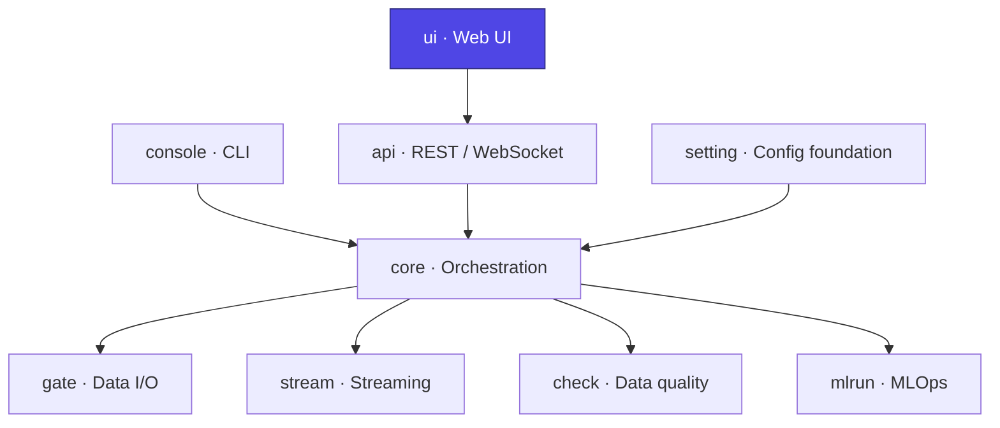

# Ducta UI

> **The web front-end of Ducta** — a React + TypeScript single-page app that provides a visual workspace for building, running, and observing Ducta pipelines. It talks to [Ducta API](../api/README.md) over REST + WebSocket and is served by that same server in production.

## At a glance

| | |
|---|---|
| **Purpose** | Visual workspace: build pipelines, edit config/code, run and observe executions |
| **Layer** | Interface (web front-end) |
| **Stack** | React 18 · TypeScript 5 · Vite 6 · React Router 7 · TanStack Query · Zustand · Zod |
| **Depends on** | [`api`](../api/README.md) over REST + WebSocket |
| **Used by** | End users (browser); built to `dist/` and served by the API |
| **Key entry points** | `main.tsx` / `App.tsx`, `npm run dev`, `npm run build`, `ducta ui` |

## Where it fits



---

## 1. Overview

### For Non-Technical Users
Ducta UI is the **app you actually click around in**. It lets you open a project, see your pipelines as a diagram, edit configuration and node code, launch runs and watch their logs stream in live, review data-quality results, and manage models — all in the browser, without touching a terminal.

### For Technical Users
Ducta UI is the presentation layer, implementing:
*   **App shell & routing**: React Router v7 (`createBrowserRouter`) with lazy-loaded pages, protected routes, workspace gating, breadcrumbs, and a top-level error boundary (`App.tsx`).
*   **Server state**: TanStack **React Query** for fetching/caching, with typed hooks over an Axios client (`api/`).
*   **Resilient API client**: shared Axios interceptors inject the auth token and per-request `source`, refresh JWTs with a queued single-flight guard, retry transient errors (429/timeout) with exponential backoff, and log out on unrecoverable 401s (`api/client.ts`).
*   **Client state**: **Zustand** stores for client-only state — auth, workspace selection, the canvas builder (with undo/redo), logs and UI preferences (`store/`). Server data (projects, pipelines, nodes) lives only in the React Query cache; see `hooks/useProjects.ts` and `api/queryKeys.ts`.
*   **Editing**: Monaco editor for node code and config, `react-hook-form` + **Zod** for forms/validation, and `js-yaml` for config round-tripping.
*   **Live execution**: WebSocket log streaming, virtualized log lists (`react-virtuoso`), and Web Workers for off-main-thread work (`workers/`).
*   **Generated types**: OpenAPI-derived TypeScript types keep the client in sync with the API (`generated/`).
*   **Quality tooling**: Storybook, Vitest + Testing Library, ESLint, and `ts-prune`.

### Tech stack
React 18 · TypeScript 5 · Vite 6 · React Router 7 · TanStack Query 5 · Zustand 5 · Zod 4 · Axios · Monaco · Vitest · Storybook.

---

## 2. Configuration

The app is configured at build/dev time via Vite env variables and the API-served bundle.

*   **`VITE_API_URL`** (default `/api`): base URL of the Ducta API. In production the UI is served from the same origin as the API, so the relative default works; point it elsewhere for a split deployment.
*   **Auth token**: stored client-side and attached as `Authorization: Bearer <token>`; refreshed automatically on 401.
*   **`source`**: the active project source (local path or Git URL) is read from storage and injected as a request param on every call, so the same UI drives many projects.
*   **Vite configs**: `vite.config.ts` (dev/app build), `vite.config.bundle.ts` (single-file bundle for embedding), `vitest.config.ts` (tests).

Build output goes to `dist/`, which the API serves as a static SPA (with a path-contained fallback to `index.html`).

---

## 3. Development

```bash
cd src/ducta/ui
npm install

# Dev server (proxies /api to the backend)
npm run dev

# Type-check + production build -> dist/
npm run build
npm run preview            # serve the built bundle locally

# Point the UI at a remote API
VITE_API_URL="https://ducta.example.com/api" npm run build
```

### Quality & tests
```bash
npm run test               # Vitest (watch)
npm run test:run           # Vitest (CI, single run)
npm run storybook          # component explorer on :6006
npm run ui:quality         # project quality gate
npm run generate-api       # regenerate typed API client from openapi.json
```

Served together with the backend: `ducta ui --port 8000` (or `ducta server start`) builds/serves this UI alongside the API on one origin.

---

## 4. Code Quickstart

### Fetch server state with a typed query hook
```tsx
import { useQuery } from "@tanstack/react-query";
import client from "../api/client";

function usePipelines(env: string) {
  return useQuery({
    queryKey: ["configs", env],
    queryFn: async () => (await client.get(`/configs/${env}`)).data,
  });
}
```

### Read server data, then change it with a mutation
Server data (projects, pipelines, nodes…) lives only in the React Query cache —
never copy it into a Zustand store. Derive views with `useMemo`, write through a
mutation, and let the mutation's invalidation refetch. Build keys with `qk`
(`api/queryKeys.ts`), never inline.
```tsx
import { useProjectList } from "../hooks/useProjects";
import { useDeleteServerProject } from "../api/queries";

function ProjectNames() {
  const { projects } = useProjectList();
  const deleteProject = useDeleteServerProject(); // invalidates qk.projects.all()
  return projects.map((p) => (
    <button key={p.id} onClick={() => deleteProject.mutate({ projectId: p.id })}>{p.name}</button>
  ));
}
```

Zustand is for client-only state: UI preferences (`uiStore`), the canvas edit
history (`builderStore`), live logs (`logsStore`), the auth session.

### Call the long-timeout execution client
```tsx
import { executionClient } from "../api/client";

async function runPipeline(projectId: string, name: string, env: string) {
  const { data } = await executionClient.post(
    `/projects/${projectId}/pipelines/${name}/execute`,
    { env },
  );
  return data.execution_id;
}
```

### Stream execution logs over WebSocket
```ts
const ws = new WebSocket(`ws://localhost:8000/api/ws/logs/${executionId}`);
ws.onmessage = (event) => appendLog(JSON.parse(event.data));
```
